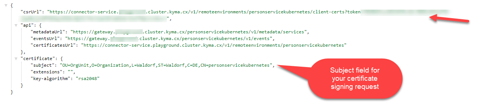
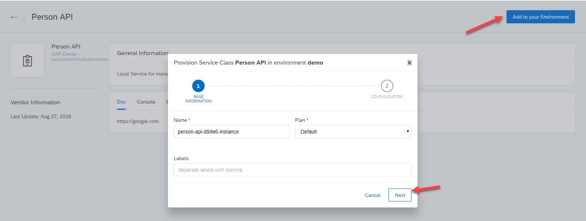
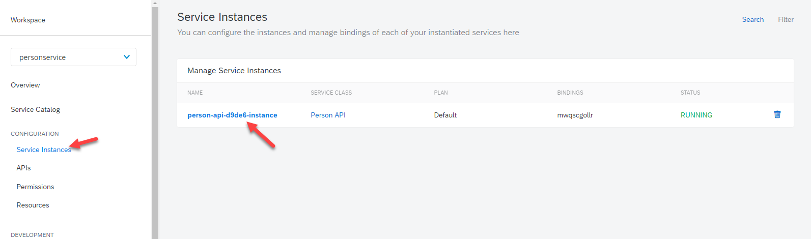
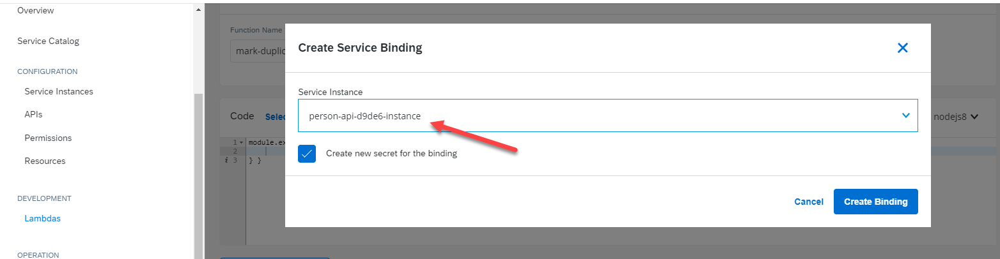
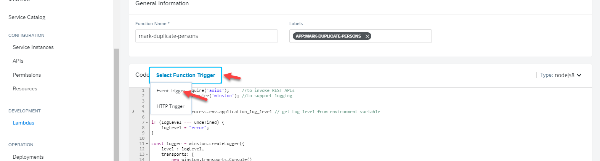
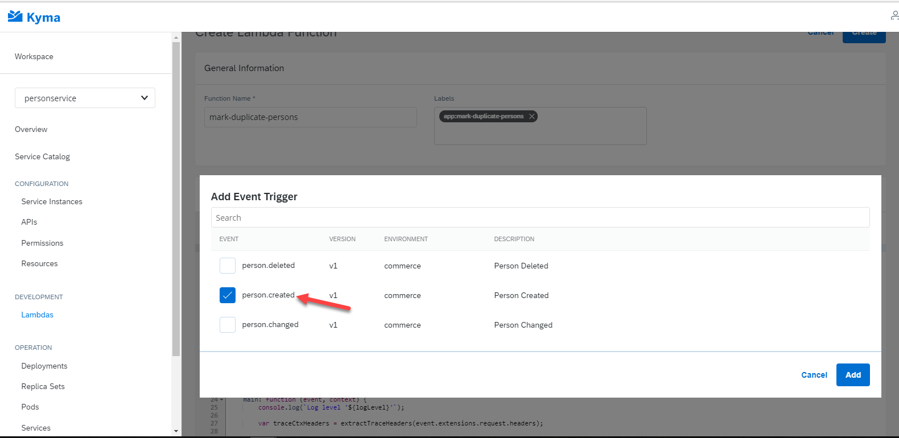
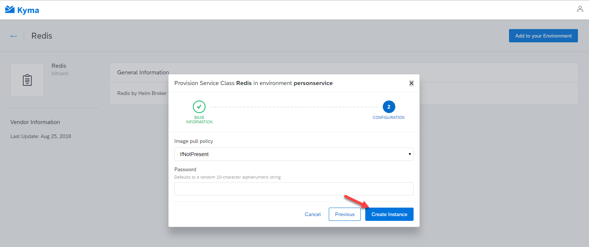
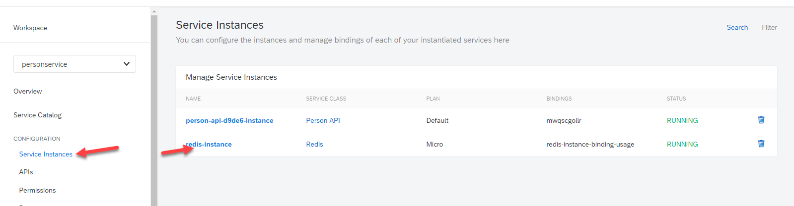
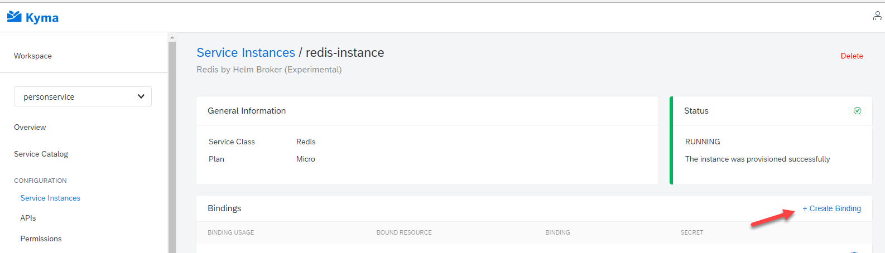

# A sample Application for running Spring Boot on Kubernetes/Kyma with Mongodb

## Table of Contents
  - [Kyma](#kyma)
  - [About](#about)
  - [First Steps: Deploy the application](#first-steps-deploy-the-application)
    - [Environment Setup](#environment-setup)
    - [Mongo DB](#mongo-db)
    - [Java Build](#java-build)
    - [Docker Credential Helper Setup](#docker-credential-helper-setup)
    - [Deploy to Local Kyma (Minikube)](#deploy-to-local-kyma-minikube)
    - [Deploy to "real" Kyma Cluster](#deploy-to-real-kyma-cluster)
    - [Checks](#checks)
    - [Try out on Kyma](#try-out-on-kyma)
  - [Connect your Service to Kyma as Extension Platform](#connect-your-service-to-kyma-as-extension-platform)
    - [About](#about)
    - [Create new Application Connector Instance on Kyma](#create-new-application-connector-instance-on-kyma)
    - [Pair Person Service with Kyma Application Connector](#pair-person-service-with-kyma-application-connector)
    - [Reconfigure Person Service](#reconfigure-person-service)
    - [Checks](#checks)
    - [Run the Scenario](#run-the-scenario)
  - [Extend your Person Service](#extend-your-person-service)
    - [Intro](#intro)
    - [Create Service Instance](#create-service-instance)
    - [Develop your Lambda Function](#develop-your-lambda-function)
    - [Deploy your Lambda Function](#deploy-your-lambda-function)
    - [Test your Lambda](#test-your-lambda)
  - [Bind your Person Service to a brokered Redis Backing Service](#bind-your-person-service-to-a-brokered-redis-backing-service)
    - [Intro](#intro)
    - [Create Redis Service Instance and Bind it to the Person Service](#create-redis-service-instance-and-bind-it-to-the-person-service)
    - [Update Kubernetes Deployment Configuration](#update-kubernetes-deployment-configuration)
    - [Test the Service](#test-the-service)


## Kyma

This App runs on Kyma (https://kyma-project.io/; for local installation see: https://github.com/kyma-project/kyma/tree/master/installation). 

## About

This sample application was created to give you a running end to end sample application implemented in Java / Spring Boot running on Kyma. In the end state it should make all the features Kyma delivers visible to you as developers. Also it should help you to get started and implement your own scenarios on Kyma. However this is not meant to be Best Practice / Production ready code. Instead it is often kept simple with manual steps to make clear what actually happens. If you have issues/remarks while using it, please feel free to feedback.  


## First Steps: Deploy the application


### Environment Setup

An Environment is a custom Kyma security and organizational unit based on the concept of Kubernetes Namespaces. Kyma Environments allow you to divide the cluster into smaller units to use for different purposes, such as development and testing.

To setup our environment issue the following command: `kubectl apply -f environment.yaml`


### Mongo DB

To deploy Mongodb use Helm (https://helm.sh/). To install helm do the following:

Innitialize Helm (if not already done, client-only option as kyma already comes with tiller installed):
`helm init --client-only` 

Then deploy Mongo DB

`helm install --name first-mongo   --set persistence.size=2Gi,    stable/mongodb --namespace personservice`

### Java Build

Project is built using: mvn clean package or mvn clean install. It uses jib (https://github.com/GoogleContainerTools/jib/tree/master/jib-maven-plugin) to build and push to a docker registry (which does not require a local docker install). You **must** use the following maven properties to adapt to your local installation: 

* docker.repositoryname: Docker repository that the image will be published to
* jib.credentialhelper: docker credential helper that will be used to acquire docker hub (adapt to YOUR Operating System, pass or secretservice for Linuy, wincred for Windows and osxkeychain for Linux)


You **can** use the following maven properties to adapt to your local installation: 

* project.version: Tag that will be assigned to docker image 
* jib.version: Version of the jib plugin that will be used
credentials (see: https://docs.docker.com/engine/reference/commandline/login/ heading: "Credential helper protocol")

For editing the code I recommend either Eclipse with Spring plugins installed or Spring Tool Suite (https://spring.io/tools/sts/all). You will also need to install the Lombok plugin (https://projectlombok.org/setup/overview). Lombok is used to generate getters/setters and sometimes constructors. It keeps the code lean and neat.

### Docker Credential Helper Setup

Docker credential helpers can be downloaded from https://github.com/docker/docker-credential-helpers. There are various versions for different Operating Systems. If you want to use docker-credential-pass please ensure that gpg and pass are installed. A detailed walkthrough is available under https://github.com/docker/docker-credential-helpers/issues/102 (Steps 1 to 10).

To provide your credentials create a json file like the one below:

```
{ 
    "ServerURL": "registry.hub.docker.com",
    "Username": "<username>", 
    "Secret": "<password>" 
}
```

To push this file into the credentials helper enter the following statement under Linux:

`cat credentials.json | docker-credential-pass store`

Windows:

`type credentials.json | docker-credential-wincred store`

To delete a set of credentials:

`echo <ServerURL> | docker-credential-pass erase`

To read a set of credentials:

`echo <ServerURL> | docker-credential-pass get`


### Deploy to Local Kyma (Minikube)

Deployment to kyma requires to upload a configmap and also a kubernetes deployment and a service.

Before deploying the attached files you need to adapt `mongo-kubernetes-local1.yaml` to your cluster. The parts that require attention are marked with `# changeme:` and instructions are available in the comments.


The below commands do this: 

```
kubectl apply -f mongo-kubernetes-configmap-local1.yaml -n personservice
kubectl apply -f mongo-kubernetes-local1.yaml -n personservice
```

`mongo-kubernetes-local1.yaml` creates the following Kubernetes objects:

* Kubernetes Deployment for the Spring App (including Istio setup)
* Kubernetes Service pointing towards the pods created by the Deployment
* Kyma API exposing the service through an Istio Ingress

To make the API accessible from your browser, you need to add the following entry to your /etc/hosts (Windows: C:\Windows\System32\drivers\etc\hosts) file, behind all other kyma entries `personservice.kyma.local`.

Also make sure you trust the self-signed kyma ssl server certificate in the browser.

### Deploy to "real" Kyma Cluster

Deployment to kyma requires to upload a configmap and also a kubernetes deployment and a service.

Before deploying the attached files you need to adapt `mongo-kubernetes-cluster1.yaml` to your cluster. The parts that require attention are marked with `# changeme:` 

The below commands do this: 

```
kubectl apply -f mongo-kubernetes-configmap-cluster1.yaml -n personservice
kubectl apply -f mongo-kubernetes-cluster1.yaml -n personservice
```

`mongo-kubernetes-configmap-cluster1.yaml` creates the following Kubernetes objects:

* Kubernetes Deployment for the Spring App (including Istio setup)
* Kubernetes Service pointing towards the pods created by the Deployment
* Kyma API exposing the service through an Istio Ingress

Your service should now be accessible on whatever you specified under `hostname: personservice.{clusterhost}`


### Checks

To check whether everything is up and running please issue the following command: `kubectl get pods -n personservice`

All pods should have status running. Otherwise repeat until this is the case.

### Try out on Kyma

After deployyment you can access the swagger documentation under https://{kymahost}/swagger-ui.html. This also allows you to try it out. 

If you don't like Open API (fka. Swagger) here is some other documentation:

The API is accessible using the following endpoints:

* GET /api/v1/person: List all persons in the DB
* POST /api/v1/person: Create person with the following data
```
{
	"firstName":"John",
	"lastName":"Doe",
	"streetAddress":"Nymphenburger Str.",
	"houseNumber":"86",
	"zip":"80636",
	"city":"Muenchen",
	"extensionFields":{
		"countryIso2":"De"
	}
}
``` 
* GET /api/v1/person/{personid}: Return all data for person with id `personid`
* DELETE /api/v1/person/{personid}: Delete person with id `personid`
* PATCH /api/v1/person/{personid}: Update person with id `personid` with the following data:
```
{
	"firstName":"Jack",
	"lastName":"Doe",
	"streetAddress":"Nymphenburger Str.",
	"houseNumber":"86",
	"zip":"80636",
	"city":"Muenchen",
	"extensionFields":{
		"countryIso2":"De"
	}
}
``` 

* POST /api/v1/person/search: Search for persons matching the following criteria:
```
{
	"city":"Muenchen",
	"extensionFields":{
		"countryIso2":"De"
	}
}
```

## Connect your Service to Kyma as Extension Platform

### About

Altough our Person Service application is running inside of Kyma, we will now treat it like any other external application (hence you can also try this outside of your Kyma instance). This is just to demonstrate what you would do with your legacy application to hook it up to Kyma. The below picture highlights what we are going to do:


1. Create/Deploy new Application Connector Instance on Kyma ==> This is to provide a dedicated Enpoint for the Person Service to connect to Kyma
2. Pair Person Service with Kyma Application Connector ==> This is to establish secure connectivity from Person Service to Kyma (even over public networks)
3. Register Personservice Metadata at the Application Connector ==> This is to fill the API and Event Catalog on Kyma
4. Fire Events to the Kyma Event Bridge ==> This is to execute event driven logic/extensions on Kyma

Steps 3 and 4 are based on deploying additional configuration to the kyma instance.


### Create new Application Connector Instance on Kyma

To connect external systems (so called remote environments) you need to use the application connector (For Details see: https://kyma-project.io/docs/latest/components/application-connector).

Application connector requires deployment of a new environment specific gateway. To do this execute the below helm command (for details see: https://kyma-project.io/docs/latest/components/application-connector#details-deploy-a-new-application-connector):

helm install --name personservicekubernetes --set deployment.args.sourceType=personservicekubernetes --set global.isLocalEnv=false --set *global.domainName=kyma.local* --namespace kyma-integration ./remote-environments

Replace *global.domainName=kyma.local* with your kyma domain.

You can download the helm chart from https://kyma-project.io/docs/latest/components/assets/remote-environments.zip 

After that you will have to restart the pod core-ui-api-* (kubectl delete in namespace kyma-system). After this your new Environment shall show up as green in the Kyma Console under "Administration -> Remote Environments" (wait for the pod core-ui-api-* to be running again).

### Pair Person Service with Kyma Application Connector

Now you need to pair the person service with the newly deployed application connector gateway instance. To do that, click on "connect remote environment":
 


Copy and follow the link in a new browser window:



Now you can create a Certificate Signing request using OpenSSL (https://www.openssl.org/) a series of commands. Before doing this create a new directory called `security` and then go ahead with OpenSSL in the new dir.

Create Key: 

```
openssl genrsa -out personservicekubernetes.key 2048
openssl req -new -sha256 -out personservicekubernetes.csr -key personservicekubernetes.key -subj "/OU=OrgUnit/O=Organization/L=Waldorf/ST=Waldorf/C=DE/CN=personservicekubernetes"
```

Now use the REST client of your choice to create the following rest call to the URL (with token highlighted in the above screenshot:


After sending you will receive a base 64 encoded signed certificate. Decode the response and save as personservicekubernetes.crt.

Now you can use OpenSSL and java keytool (part of the jdk) to create a PKCS#12 (P12, also good for browser based testing) file and based on that create a Java Key Store (JKS, for the Person Service) for our service. **Do not change any passwords, except if you really know what you are doing!!!**

```
openssl pkcs12 -export -name personservicekubernetes -in personservicekubernetes.crt -inkey personservicekubernetes.key -out personservicekubernetes.p12 -password pass:kyma-project

keytool -importkeystore -destkeystore personservicekubernetes.jks -srckeystore personservicekubernetes.p12 -srcstoretype pkcs12 -alias personservicekubernetes  -srcstorepass kyma-project -storepass kyma-project
```

Now copy the resulting `personservicekubernetes.p12` file to folder security. 

To test your deployed application connector instance you can also import the personservicekubernetes.p12 file into your Browser and call the url depicted as metadataUrl in the initial pairing response JSON. If you are running on locally on Minikube the port of the gateway needs to be determined separately. To do this, issue the following command:

```
kubectl -n kyma-system get svc core-nginx-ingress-controller -o 'jsonpath={.spec.ports[?(@.port==443)].nodePort}'
```

The use the resulting port in your URL, e.g.: https://gateway.{clusterhost}:{port}/personservicekubernetes/v1/metadata/services

### Reconfigure Person Service

To start with we need to deploy the newly created keystore to the cluster. to do so change directory to `security` and then issue the following command:

`kubectl create secret generic kyma-certificate --from-file=personservicekubernetes.jks -n personservice`

After that we need to create a new config map which is containing a file with all details needed to register the Person Service at the Kyma Cluster. If you want to know more about this step, refer to https://kyma-project.io/docs/latest/components/application-connector#details-api and the surrounding sections. For simplicity all registration information is maintained in file `registration/registrationfile.json`. The contents of this file will be posted against the `/v1/metadata/services` endpoint. If you are running on a "real" cluster, you **must** update the `targetUrl` field in the `api` block to point to your Person Service:

```
"api": {
    "targetUrl": "changeme",
    "spec": {}    	
  },
```

When running locally on Minikube you have to point targetUrl to http://personservice.personservice.svc.cluster.local:8080.

After updating the file, upload it to Kyma as another configmap:

`kubectl create configmap registrationfile --from-file=registrationfile.json -n personservice`

To make the service aware of the gateway you need to update fields marked with `# changeme:` in `mongo-kubernetes-configmap-local2.yaml` or `mongo-kubernetes-configmap-cluster2.yaml`. Then apply as follows:

* Minikube: `kubectl apply -f mongo-kubernetes-configmap-local2.yaml -n personservice`
* Cluster: `kubectl apply -f mongo-kubernetes-configmap-cluster2.yaml -n personservice`


Now (based on your Kyma cluster type) you again need to update the fields marked with `# changeme:` in `mongo-kubernetes-cluster2.yaml` or `mongo-kubernetes-local2.yaml` and issue the following command:

* Minikube: `kubectl apply -f mongo-kubernetes-local2.yaml -n personservice`
* Cluster: `kubectl apply -f mongo-kubernetes-cluster2.yaml -n personservice`

### Checks

To check whether your changes are active, issue the following command untiul you again have **exactly** 2 Pods of `personservice-*-*` in status running: `kubectl get pods -n personservice`.

After that issue a kubectl describe command for 1 of the pods (replacing '\*' with actual values): `kubectl describe pod personservice-*-* -n personservice`

The output must look something like this ('..' depicts other content which I deleted):

```
Name:           personservice-*-*
Namespace:      personservice

..

Init Containers:
  istio-init:
  
   ..
   
Containers:
  personservice:
    Container ID:   
    
    ..
    
    Environment:
      .. 
      
      personservicekubernetes_applicationconnetor_baseurl:  <set to the key 'connector_baseurl' of config map 'mongo-kubernetes-config'>        Optional: false
      spring_profiles_active:                               ApplicationConnector
     
      ..
    
    Mounts:
      /registration from registrationfile (ro)
      /security from kyma-certificate (ro)
      /var/run/secrets/kubernetes.io/serviceaccount from default-token-6nb7x (ro)
       
  ..
  
Volumes:
  registrationfile:
    Type:      ConfigMap (a volume populated by a ConfigMap)
    Name:      registrationfile
    Optional:  false
  kyma-certificate:
    Type:        Secret (a volume populated by a Secret)
    SecretName:  kyma-certificate
    Optional:    false

```

### Run the Scenario

After deployyment you can access the swagger documentation under https://{kymahost}/swagger-ui.html. Here you should execute the POST against `/api/v1/applicationconnector/registration`. This will perform step 3 of the pairing process.


Now you should see the following under Remote Environments:


This means now you can bind this 'Remote Environment' to a 'Kyma Environment' and process events in Serverless Lambda functions. To do so, bind the Remote Environment 'personservicekubernetes' to the Kyma Environment 'personservice'. Then go to the Kyma Environment personservice's 'Service Catalog' and explore the Service 'Person API'.


Now you are ready to instantiate the service and bind it to Lambda's and deployments which implement your extension logic.

## Extend your Person Service

### Intro

The preferred way to extend business applications with Kyma is through event driven Lambda (serverless) functions. In the subsequent chapters you will see how to implement such a Lambda function using Node.js and how to bind it to the person maintained Event. 

The function as such is pretty simple. It is triggered when a person was changed (created or updated). Then the logic goes as follows:

1. Call personservice API to retrieve details about the person that what changed (GET /api/v1/person/{id})
2. Call personservice API to retrieve a list of persons with the same values (POST /api/v1/search)
3. Call personservice API to persist a list of IDs on the extension field "duplicatePersons" (PATCH /api/v1/person/{id}) for all identified duplicates

As always this function is not intended for productive use. 

### Create Service Instance

A precondition for this scenario is that all steps mentioned in [Run the Scenario](#run-the-scenario) have been executed properly.

In your Kyma Envirnoment ("Personservice") go to the Service Catalog and create a new service instance of the Person API:




After that verify your instance by going "Back" and clicking on "Service Instances":




### Develop your Lambda Function

When developing Lambda functions I like to start locally using the IDE of my choice. Kyma lambda functions are basically "normal" Node.js modules containing the containing the following snippet:

```
module.exports = { 
	main: function (event, context) {
		//code goes here
	} 
}

```

The meaning and contents of the event and context object is described in https://kyma-project.io/docs/latest/components/serverless#model-model. 

As soon as a Lambda requires NPM dependencies, it also require a package.json file (easiest way to create a skeleton is `npm init`). Dependencies are then managed in the dependencies section:

```
{
  "name": "personservicelambda",
  "version": "1.0.0",
  "description": "Demo Lambda for the Person Service",
  "main": "personservice.js",
  "keywords": [
    "kyma"
  ],
  "dependencies": {
    "axios": "^0.18.0",
    "winston": "^3.0.0",
    "dotenv":"^6.0.0"
  }
}
```

Kyma injects service bindings (including Remote Environments) as Environment Variables to be able to mimic this behavior locally the package "dotenv" can be used. it basically converts the contents of a ".env" (no filename, literally ".env") to normal environment variables that can be accessed through `process.env.environment_variable_name` in your code. Sample for that would be (getting the internal URL of the API Connector pointing to the Remote Environment):

```
require('dotenv').config();

console.log(`GATEWAY_URL = ${process.env.GATEWAY_URL}`);
```

To run your Lambda locally you also need a wrapper. The below snippet is actually used to run the code of the sample Lambda:

```
require('dotenv').config();
const personservice = require('./personservicemodule');

console.log(`GATEWAY_URL = ${process.env.GATEWAY_URL}`);

var event = { //build a dummy event
    "data": {
        "personid":process.env.PERSON_ID
    },
    "extensions": {
        "request": {
            "headers": {
                "x-request-id":"hellotracer"
            }
        }
    
    }
}


personservice.main(event,{}); //invoke the lambda
```

The code for the sample Lambda function is contained in the "Lambda" folder. in order to run it locally, ensure you have a Node.js (https://nodejs.org/en/download/) environment (Version 8.x installed, to check, execute `node --version`). You also need to make a few changes to the ".env" file. Again you need to replace all occurrences of replaceme. "GATEWAY_URL" must have a value pointing to your deployment of personservice (only root, no "/" in the end). "PERSON_ID" must be the ID of a person in your mongo db (basically GET /api/v1/person/{PERSON_ID} must return a 200 status code).

Then install the dependencies: `npm install axios winston dotenv`
After that you can run your service: `node personservicecaller.js`

This should give you a fair idea of how to develop Lambdas.


### Deploy your Lambda Function

To deploy your Lambda you need to go to your "personservice" Kyma environment. Click on Lambdas and create a new one. Fill all the fields shown in the below screenshots and then save:









Now the command `kubectl get pods -n personservice -l app=mark-duplicate-persons` should return a pod in status running (might take several repetions though). Now you can issue the following command to inspect the logs: `kubectl logs -n personservice -l app=mark-duplicate-persons -c mark-duplicate-persons`. As nothing is happening, you should only see the periodic health checks:

```
::ffff:127.0.0.1 - - [28/Aug/2018:14:37:48 +0000] "GET /healthz HTTP/1.1" 200 2 "-" "curl/7.38.0"
::ffff:127.0.0.1 - - [28/Aug/2018:14:37:53 +0000] "GET /healthz HTTP/1.1" 200 2 "-" "curl/7.38.0"
::ffff:127.0.0.1 - - [28/Aug/2018:14:37:58 +0000] "GET /healthz HTTP/1.1" 200 2 "-" "curl/7.38.0"
::ffff:127.0.0.1 - - [28/Aug/2018:14:38:03 +0000] "GET /healthz HTTP/1.1" 200 2 "-" "curl/7.38.0"
::ffff:127.0.0.1 - - [28/Aug/2018:14:38:08 +0000] "GET /healthz HTTP/1.1" 200 2 "-" "curl/7.38.0"
::ffff:127.0.0.1 - - [28/Aug/2018:14:38:13 +0000] "GET /healthz HTTP/1.1" 200 2 "-" "curl/7.38.0"
::ffff:127.0.0.1 - - [28/Aug/2018:14:38:18 +0000] "GET /healthz HTTP/1.1" 200 2 "-" "curl/7.38.0"
::ffff:127.0.0.1 - - [28/Aug/2018:14:38:23 +0000] "GET /healthz HTTP/1.1" 200 2 "-" "curl/7.38.0"
::ffff:127.0.0.1 - - [28/Aug/2018:14:38:28 +0000] "GET /healthz HTTP/1.1" 200 2 "-" "curl/7.38.0"
::ffff:127.0.0.1 - - [28/Aug/2018:14:38:33 +0000] "GET /healthz HTTP/1.1" 200 2 "-" "curl/7.38.0"
::ffff:127.0.0.1 - - [28/Aug/2018:14:38:38 +0000] "GET /healthz HTTP/1.1" 200 2 "-" "curl/7.38.0"
::ffff:127.0.0.1 - - [28/Aug/2018:14:38:43 +0000] "GET /healthz HTTP/1.1" 200 2 "-" "curl/7.38.0"
::ffff:127.0.0.1 - - [28/Aug/2018:14:38:48 +0000] "GET /healthz HTTP/1.1" 200 2 "-" "curl/7.38.0"
::ffff:127.0.0.1 - - [28/Aug/2018:14:38:53 +0000] "GET /healthz HTTP/1.1" 200 2 "-" "curl/7.38.0"
```

### Test your Lambda

Now you can again use the API as depicted in section [Try out on Kyma](#try-out-on-kyma). Here you basically only have to create a new person using the POST /api/v1/person operation (make sure the record is **unique in your Database**. The easiest way to ensure that, is to invoke the DELETE /api/v1/person operation to empty the database). Make sure you get a 201 response code.

The log, inspected by `kubectl logs -n personservice -l app=mark-duplicate-persons -c mark-duplicate-persons`, should contain something similar to:

```
Log level 'info'
{"level":"info","message":"Event received for personid '5b85601a8a50350001a0c160'"}
::ffff:127.0.0.1 - - [28/Aug/2018:14:45:47 +0000] "POST / HTTP/1.1" 200 - "-" "Go-http-client/1.1"
{"level":"info","message":"Number of matching Persons found: 1"}
```

This means the lambda was executed and no duplicates have been found (search returned only one result). Now create a duplicate using the POST /api/v1/person operation. Again make sure you get a 201 response code.

Now the log, inspected by `kubectl logs -n personservice -l app=mark-duplicate-persons -c mark-duplicate-persons`, should contain something similar to:

```
{"level":"info","message":"Event received for personid '5b85601a8a50350001a0c160'"}
::ffff:127.0.0.1 - - [28/Aug/2018:14:49:01 +0000] "POST / HTTP/1.1" 200 - "-" "Go-http-client/1.1"
{"level":"info","message":"Number of matching Persons found: 2"}
{"level":"info","message":"Person 5b8560dd4b2eaa0001897227 successfully updated"}
{"level":"info","message":"Person 5b85601a8a50350001a0c160 successfully updated"}
```

Also invoking GET /api/v1/person/{id} should now show a result with extensionFields/duplicatePersons containing an array of person IDs:

```
{
  "id": "5b8560dd4b2eaa0001897227",
  "firstName": "John",
  "lastName": "Doe",
  "streetAddress": "Nymphenburger Str.",
  "houseNumber": "86",
  "zip": "80636",
  "city": "Muenchen",
  "extensionFields": {
    "duplicatePersons": [
      "5b85601a8a50350001a0c160",
      "5b8560dd4b2eaa0001897227"
    ]
  }
}

```

## Bind your Person Service to a brokered Redis Backing Service 

### Intro

Applications often times require backing services such as databases, caches, message brokers, etc. In a cloud world these are generally provided and managed by the cloud provider with clear SLAs. These services are generally discovered in a central service catalog. Once a service is deemed relevant it is instantiated (i.e. a Service instance is created, which would map to a e.g. a database instance). This instance is then provided to your application using a binding (i.e. the configuration needed to access the service is injected into the application/container using environment variables). This process nicely decouples application from cloud infrastructure and hence makes it portable.

In this example we are going to address the issue with frequent callbacks of the lambda to our service. To mitigate the consequences for the database we are going to introduce caching. For that we are going to enable caching in the Spring Application and hook it up to a Redis cache which is provisioned via the Helm broker (a hidden feature of Kyma making cloud like service brokers also available locally, it basically wraps the same procedure we have used to provision the [Mongo DB](#mongo-db) in a "normal" service broker process). 

### Create Redis Service Instance and Bind it to the Person Service

To create a service instance you need to go to the service catalog in your Kyma Environment ("personservice"). Navigate to Redis:


Add and configure a new instance to your environment:




After you have created your instance you have to bind it to the Persons Service. To do that, go to Service Instances and navigate to your created instance.



Create a new binding and click through the wizard:




After that, check whether your personservice pods are running: `kubectl get pods -n personservice -l app=personservice`

Then invoke the environment api of the person service (this is returning a json representation of all environment variables part of the container):`https://personservice.{cluster}/api/v1/environment` and search for the following variables:

* HOST
* PORT
* REDIS_PASSWORD

If you don't find them, restart your pods and try again: `kubectl delete pods -n personservice -l app=personservice` (Deployment controller will recreate them ;-)).

The variables are injected through the Binding (details are available in the documentation).

```
spec:
  containers:
  - envFrom:
    - secretRef:
        name: redis-instance-binding
```

To see the concrete values, issue the following command: `kubectl get secret -n d046471 -o yaml redis-instance-binding`. The values are base64 encoded.


### Update Kubernetes Deployment Configuration

In order for the personservice to properly connect to the redis cache, you need to set a couple of environment variables. To do so, `mongo-kubernetes-local3.yaml` or `mongo-kubernetes-cluster3.yaml` have been adapted. However you still need to replace the values depicted with `#changeme` to cater to your environment. Below the the changed values to bind to the service:

```
              - name: spring_profiles_active
                value: "ApplicationConnector,Cache"
              - name: logging_level_com_sap_demo_service
                value: "TRACE"
              - name: spring_redis_host
                value: "${HOST}"   
              - name: spring_redis_port
                value: "${PORT}"
              - name: spring_redis_password
                value: "${REDIS_PASSWORD}"
```

Make the following settings:

* `spring_profiles_active`: This is used to activate the PersonServiceCache.java implementation
* `logging_level_com_sap_demo_service`: Activate logging to be able to see cache in trace results
* `spring_redis_host`: This is to provide a reference to the redis host. By putting the value in the proposed format (${HOST}) you are pointing spring to another environment variable which is introduced through the binding.
* `spring_redis_port`: This is to provide a reference to the redis port.
* `spring_redis_password`: This is to provide a reference to the redis password.

Now you can update your deployment and restart the pods:

* Local:

```
kubectl apply -f mongo-kubernetes-local3.yaml -n personservice
kubectl delete pods -n personservice -l app=personservice

```

* Cluster:

```
kubectl apply -f mongo-kubernetes-local3.yaml -n personservice
kubectl delete pods -n personservice -l app=personservice
```

### Test the Service

To test this you will have to stream the logs of your personservice. To do this issue the following command: `kubectl logs -n personservice {your pod}  personservice --follow` (replace "{your pod}" with the name of your pod).

Now invoke GET /api/v1/person/{personid}. During the first call you should see something along the lines of the below example. All subsequent calls will not appear as they will be directly fetched from the cache.

```
Entering public com.sap.demo.entity.Person com.sap.demo.service.PersonServiceCache.findPerson(java.lang.String) with Arguments:
class java.lang.String: 5b8560dd4b2eaa0001897227
2018-08-31 11:20:50.577 DEBUG 1 --- [nio-8080-exec-2] com.sap.demo.service.PersonServiceCache  : 2e8ff093-4c1c-9b1b-a274-5e8a63f1cc84: Cache miss for Person ID: 5b8560dd4b2eaa0001897227
2018-08-31 11:20:50.577 TRACE 1 --- [nio-8080-exec-2] com.sap.demo.service.PersonServiceCache  : 2e8ff093-4c1c-9b1b-a274-5e8a63f1cc84:
Exiting PersonServiceCache.findPerson(..) with result: Person(id=5b8560dd4b2eaa0001897227, firstName=John, lastName=Doe, streetAddress=Nymphenburger Str., houseNumber=86, zip=80636, city=Muenchen, extensionFields={duplicatePersons=[5b85601a8a50350001a0c160, 5b8560dd4b2eaa0001897227]})
```

