# A sample Application based on Spring Boot showing the features of Kyma

## Table of Contents

- [A sample Application based on Spring Boot showing the features of Kyma](#a-sample-application-based-on-spring-boot-showing-the-features-of-kyma)
  - [Table of Contents](#table-of-contents)
  - [Overview](#overview)
  - [Prerequisites](#prerequisites)
  - [Deploy the application](#deploy-the-application)
    - [Tools required](#tools-required)
    - [Connect to your Kyma Instance](#connect-to-your-kyma-instance)
    - [Finding your Clusterdomain](#finding-your-clusterdomain)
    - [Namespace Setup](#namespace-setup)
    - [Mongo DB](#mongo-db)
      - [Helm Template](#helm-template)
      - [Normal Helm](#normal-helm)
    - [Docker Credential Helper Setup](#docker-credential-helper-setup)
    - [Java Build](#java-build)
    - [Docker Credential Helper Setup](#docker-credential-helper-setup-1)
    - [Deploy Kyma locally (Minikube)](#deploy-kyma-locally-minikube)
    - [Deploy Kyma in a cluster](#deploy-kyma-in-a-cluster)
    - [Checks](#checks)
    - [Try out on Kyma](#try-out-on-kyma)
  - [Connect your Service to Kyma as Extension Platform](#connect-your-service-to-kyma-as-extension-platform)
    - [About](#about)
    - [Create new Application Connector Instance on Kyma](#create-new-application-connector-instance-on-kyma)
    - [Pair Person Service with Kyma Application Connector](#pair-person-service-with-kyma-application-connector)
    - [Option 1: Manual Pairing with Kyma](#option-1-manual-pairing-with-kyma)
    - [Option 2: Automatic Pairing with Kyma](#option-2-automatic-pairing-with-kyma)
    - [Checks](#checks-1)
  - [Extend your Person Service](#extend-your-person-service)
    - [Intro](#intro)
    - [Create Service Instance](#create-service-instance)
    - [Develop your Lambda Function](#develop-your-lambda-function)
    - [Deploy your Lambda Function](#deploy-your-lambda-function)
    - [Test your Lambda](#test-your-lambda)
  - [Bind your Person Service to a brokered Redis Backing Service](#bind-your-person-service-to-a-brokered-redis-backing-service)
    - [Intro](#intro-1)
    - [Create Redis Service Instance and Bind it to the Person Service](#create-redis-service-instance-and-bind-it-to-the-person-service)
    - [Update Kubernetes Deployment Configuration](#update-kubernetes-deployment-configuration)
    - [Test the Service](#test-the-service)
  - [Protect the Service](#protect-the-service)
    - [Intro](#intro-2)
    - [Register an OAuth2 Client](#register-an-oauth2-client)
    - [Add Authentication/Authorization to the exposed API](#add-authenticationauthorization-to-the-exposed-api)
    - [Security For Lambdas](#security-for-lambdas)
    - [Test the Service](#test-the-service-1)
  - [Operate your Service: Make it Self-Healing](#operate-your-service-make-it-self-healing)
    - [Intro](#intro-3)
    - [Preparation](#preparation)
    - [Determining whether your service is alive](#determining-whether-your-service-is-alive)
    - [Determining whether your service is ready to serve traffic](#determining-whether-your-service-is-ready-to-serve-traffic)
    - [Deploying to Kyma](#deploying-to-kyma)
    - [Testing](#testing)
  - [Operate your Service: Traces and Logs](#operate-your-service-traces-and-logs)
    - [Intro](#intro-4)
    - [Testing Tracing](#testing-tracing)
    - [Testing Logging](#testing-logging)
  - [Operate your Service: Metrics](#operate-your-service-metrics)
    - [Intro](#intro-5)
    - [Collecting Metrics in Prometheus](#collecting-metrics-in-prometheus)
    - [Creating a Dashboard](#creating-a-dashboard)
  - [Known Issues](#known-issues)
    - [Application Connector Security](#application-connector-security)

## Overview

This sample application was created to give you a running end to end sample application implemented in Java / Spring Boot running on Kyma. In the end state it should make all the features Kyma delivers visible to you as developers. Also it should help you to get started and implement your own scenarios on Kyma.

> **NOTE:** This showcase is not meant to be Best Practice / Production ready code. Instead it is often kept simple with manual steps to make clear what actually happens. If you have issues/remarks while using it, please feel free to feedback.  

## Prerequisites

This application runs on [Kyma](https://kyma-project.io). Therefore, to try out this example on your local machine you need to [install Kyma](https://kyma-project.io/docs/latest/root/kyma#installation-installation) first, or have access to Kyma cluster.  

**  
This example is tested and based on [Kyma 1.11.0](https://github.com/kyma-project/kyma/releases/tag/1.11.0). Compatibility with other versions is not guaranteed.**

Although minikube is provided as an option, it is not recommended. It is at your own risk and some steps will not work.

## Deploy the application

### Tools required

In order to work with this example, the following installations are required on your computers:

1. [Kubernetes CLI / kubectl](https://kubernetes.io/docs/tasks/tools/install-kubectl/)
2. Helm:
   1. Client version [2.10](https://github.com/helm/helm/releases/tag/v2.10.0) 
   2. [Install Guide](https://v2-14-0.helm.sh/docs/using_helm/#installing-helm)
3. Node.Js 8
4. [CURL](https://curl.haxx.se/download.html)
5. [JQ](https://stedolan.github.io/jq/)
6. Java Tools and how to set them up:
   1. Java JDK
   2. [Maven](http://maven.apache.org/install.html)
   3. [Java IDE](#java-build)
   4. [Docker Credential Helper](#docker-credential-helper-setup)


The following CLI command 

### Connect to your Kyma Instance

Kubernetes comes with a powerful api, which is often accessed via the [kubectl cli](https://kubernetes.io/docs/reference/kubectl/kubectl/). Kubectl needs to be present on you local machines to get started. 

In order to access your Kubernetes environment, kubectl requires configuration often referred to as kubeconfig. Your Kyma Cluster comes with its own kubeconfig that you can download from the Kyma UI. To do so, first go to `Settings`:

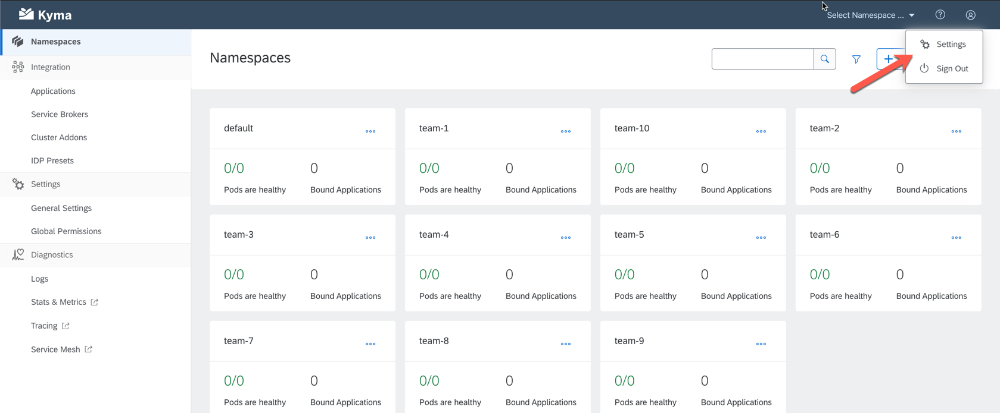


Then click on the `Download config` button:


Now you need to point your kubernetes cli /kubectl to the downloaded kubeconfig. This is done by exporting an environment variable:

´export KUBECONFIG=<PATH/Filename of the downloaded file>´


The conftained file expires after some time. So periodically download a new file, especially when you experience error messages like: `error you must be logged in ...`

A detailed description of how to do this is provided [in the official documentation](https://kyma-project.io/docs/#tutorials-sample-service-deployment-on-a-cluster-get-the-kubeconfig-file-and-configure-the-cli).

### Finding your Clusterdomain

When you install kyma on a cluster (not minikube) you will have a so called clusterdomain. The clusterdomain will be used throughout this guide, so make sure you remember the one of your cluster. 

When accessing the Kyma UI, the url looks similar to https://console.mycluster.mydomain.com/. In this example the clusterdomain would be `mycluster.mydomain.com`. 

The following cli command helps to get the clusterdomain (given you are authorized):

```
export KYMA_CONSOLE=$(kubectl get virtualservice core-console -n kyma-system -o jsonpath='{ .spec.hosts[0] }')
echo "Your Clusterdomain is: ${KYMA_CONSOLE#console.}"
```


### Namespace Setup

A Namespace is a custom Kyma security and organizational unit based on the concept of Kubernetes Namespaces. Kyma Namespaces allow you to divide the cluster into smaller units to use for different purposes, such as development and testing. 

To setup the namespace for this showcase call this command from the project root:

`kubectl create ns personservice`


### Mongo DB

To deploy Mongodb use Helm (https://helm.sh, currently client version [2.10](https://github.com/helm/helm/releases/tag/v2.10.0) is recommended). 

The helm chart used for MongoDB is not fully compatible with Kyma's [Service Mesh Istio](https://kyma-project.io/docs/components/service-mesh/). Hence we will flag the deployment to be excluded from the Service Mesh. To ensure it is still reachable for workloads that are part of the mesh, we will deploy a destination rule that permits communication. To do so execute: `kubectl apply -n personservice -f destination-rule-mongo.yaml`

Helm 2 has a client and a server component (tiller). For details please look at the [Helm Architecture](https://v2-14-0.helm.sh/docs/architecture/). In Kyma the connection between helm and tiller is secured through [tls](https://v2-14-0.helm.sh/docs/using_helm/#configuring-the-helm-client). Obtaining the neccessary certificates, requires priviliges in Kyma managed namespaces which are not universally available. To work around this, helm offers a "template" mode that generates normal Kubernetes manifests which can be deployed with `kubectl apply`. Below we describe both the [normal](#normal-helm) and the more universal [template](#helm-template) mode. Pick either of the two.

#### Helm Template

1. Initialize Helm: `helm init --client-only`
2. Download the components of the Helm Chart: `helm fetch --untar stable/mongodb`
3. Create the kubernetes manifests with your specific configuration: `helm template --name first-mongo --set "podAnnotations.sidecar\.istio\.io/inject='false',persistence.size=2Gi" mongodb > mongodb.yaml`
4. Deploy MongoDB to you Kyma cluster: `kubectl apply -n personservice -f mongodb.yaml`  

#### Normal Helm 

1. First we need to fetch certificates from our cluster to have a secure communication via helm. Navigate to your `~/.helm` directory and get the certificates:  
`kubectl get -n kyma-installer secret helm-secret -o jsonpath="{.data['global\.helm\.ca\.crt']}" | base64 --decode > "ca.pem"`  
`kubectl get -n kyma-installer secret helm-secret -o jsonpath="{.data['global\.helm\.tls\.crt']}" | base64 --decode > "cert.pem"`  
`kubectl get -n kyma-installer secret helm-secret -o jsonpath="{.data['global\.helm\.tls\.key']}" | base64 --decode > "key.pem"`

2. Initialize Helm (if not already done, client-only option as kyma already comes with tiller installed):  
`helm init --client-only`

2. Then deploy Mongo DB:  
`helm install --tls --name first-mongo --set --set "podAnnotations.sidecar\.istio\.io/inject='false',persistence.size=2Gi" stable/mongodb --namespace personservice` 

### Docker Credential Helper Setup

Docker credential helpers can be downloaded from https://github.com/docker/docker-credential-helpers. There are various versions for different Operating Systems. If you want to use docker-credential-pass please ensure that gpg and pass are installed. A detailed walkthrough is available under https://github.com/docker/docker-credential-helpers/issues/102 (Steps 1 to 10).

To provide your credentials create a json file like the one below:

```
{ 
    "ServerURL": "registry.hub.docker.com",
    "Username": "<username>",
    "Secret": "<password>"
}
```

To push this file into the credentials helper enter the following statement under Linux:

`cat credentials.json | docker-credential-osxkeychain store`

Windows:

`type credentials.json | docker-credential-wincred store`

To delete a set of credentials:

`echo <ServerURL> | docker-credential-osxkeychain erase`

To read a set of credentials:

`echo <ServerURL> | docker-credential-osxkeychain get`

### Java Build
Project is built using:  
`mvn clean package`  

It uses jib (https://github.com/GoogleContainerTools/jib/tree/master/jib-maven-plugin) to build and push to a docker registry (which does not require a local docker install). You **must** use the following maven properties to adapt your local installation:

- docker.repositoryname: Docker repository that the image will be published to (just replace by username on docker hub)
- jib.credentialhelper: Docker credential helper that will be used to acquire docker hub credentials (see: https://docs.docker.com/engine/reference/commandline/login/ heading: "Credential helper protocol") (adapt to YOUR OS, pass or secretservice for Linux, wincred for Windows and osxkeychain for Mac)

You **can** use the following maven properties to adapt to your local installation:

* project.version: Tag that will be assigned to docker image
* jib.version: Version of the jib plugin that will be used

For editing the code I recommend either Eclipse with Spring plugins installed or Spring Tool Suite (https://spring.io/tools/sts/all). You will also need to install the Lombok plugin (https://projectlombok.org/setup/overview). Lombok is used to generate getters/setters and sometimes constructors. It keeps the code lean and neat.

### Docker Credential Helper Setup

Docker credential helpers can be downloaded from https://github.com/docker/docker-credential-helpers. There are various versions for different Operating Systems. If you want to use docker-credential-pass please ensure that gpg and pass are installed. A detailed walkthrough is available under https://github.com/docker/docker-credential-helpers/issues/102 (Steps 1 to 10).

To provide your credentials create a json file like the one below:

```
{ 
    "ServerURL": "registry.hub.docker.com",
    "Username": "<username>",
    "Secret": "<password>"
}
```

To push this file into the credentials helper enter the following statement under Linux:

`cat credentials.json | docker-credential-osxkeychain store`

Windows:

`type credentials.json | docker-credential-wincred store`

To delete a set of credentials:

`echo <ServerURL> | docker-credential-osxkeychain erase`

To read a set of credentials:

`echo <ServerURL> | docker-credential-osxkeychain get`

### Deploy Kyma locally (Minikube)

Deploying Kyma requires to upload a configmap and also a kubernetes deployment and a service.

Before deploying the provided files, you **can** adapt them to your environment. Fields that can be changed are flagged with `#changeme:`. The following changes are highlighted in `mongo-kubernetes-local1.yaml`:

* You can adapt the deployment's pod spec to use your own docker image. To do so, search for the `image: "personservice/mongokubernetes:1.11.0"` instruction flagged with `#changeme:`  and replace the (working) standard image with your own.


To get the initial setup running, issue the following commands.  

```
kubectl apply -f mongo-kubernetes-configmap-local.yaml -n personservice
kubectl apply -f mongo-kubernetes-local1.yaml -n personservice
```

`mongo-kubernetes-local1.yaml` creates the following Kubernetes objects:

* Kubernetes Deployment for the Spring App (including Istio setup)
* Kubernetes Service pointing towards the pods created by the Deployment
* Kyma API exposing the service through an Istio Ingress

To make the API accessible from your browser, you need to add the following entry to your /etc/hosts (Windows: C:\Windows\System32\drivers\etc\hosts) file, behind all other kyma entries `personservice.kyma.local`.

Also make sure you trust the self-signed kyma ssl server certificate in the browser.

### Deploy Kyma in a cluster

Deployment to kyma requires to upload a configmap and also a kubernetes deployment and a service.

Before deploying the provided files, you need to adapt them to your environment. Fields that require changes are flagged with `#changeme:`. The following changes are highlighted in `mongo-kubernetes-cluster1.yaml`:

* You have to adjust the [APIRule](https://kyma-project.io/docs/components/api-gateway-v2/#custom-resource-api-rule) to reflect your clusterdomain. To do so, search for the `host: personservice.{clusterdomain}` instruction flagged with `#changeme:` and replace the `{clusterdomain}` with your own cluster's domain.
* You can adapt the deployment's pod spec to use your own docker image. To do so, search for the `image: "personservice/mongokubernetes:1.11.0"` instruction flagged with `#changeme:`  and replace the (working) standard image with your own.

The following change is highlighted in `mongo-kubernetes-configmap-cluster.yaml`:

* You have to adjust a configuration property used to generate the hostname in the swagger configuration. To do so, search for the `service_host: personservice.{clusterdomain}` instruction flagged with `#changeme:` and replace the `{clusterdomain}` with your own cluster's domain.
 
To get the initial setup running, issue the following commands.  

```
kubectl apply -f mongo-kubernetes-configmap-cluster.yaml -n personservice  
kubectl apply -f mongo-kubernetes-cluster1.yaml -n personservice
```

`mongo-kubernetes-cluster1.yaml` creates the following Kubernetes objects:

* Kubernetes Deployment for the Spring App (including Istio setup)
* Kubernetes Service pointing towards the pods created by the Deployment
* Kyma API exposing the service through an Istio Ingress

Your service should now be accessible on whatever you specified under `personservice.{clusterdomain}` (clusterdomain being the domain of your kyma cluster).


### Checks

To check whether everything is up and running please issue the following command:  
`kubectl get pods -n personservice -w`

Wait until all pods are in `running` state.

### Try out on Kyma

After deployyment you can access and try out the swagger documentation under  
`https://personservice.{clusterdomain}/swagger-ui.html` or if you are running on minikube `https://personservice.kyma.local/swagger-ui.html`.

If you don't like Open API (fka. Swagger) here is some other documentation:  

The API is accessible using the following endpoints:

* GET /api/v1/person: List all persons in the DB
* POST /api/v1/person: Create person with the following data
```
{
	"firstName":"John",
	"lastName":"Doe",
	"streetAddress":"Nymphenburger Str.",
	"houseNumber":"86",
	"zip":"80636",
	"city":"Muenchen",
	"extensionFields":{
		"countryIso2":"De"
	}
}
``` 
* GET /api/v1/person/{personid}: Return all data for person with id `personid`
* DELETE /api/v1/person/{personid}: Delete person with id `personid`
* PATCH /api/v1/person/{personid}: Update person's name with id `personid` with the following data:
```
{
	"firstName":"Jack",
}
```

* POST /api/v1/person/search: Search for persons matching the following criteria:
```
{
	"city":"Muenchen",
	"extensionFields":{
		"countryIso2":"De"
	}
}
```

## Connect your Service to Kyma as Extension Platform

### About
Altough our Person Service application is running inside of Kyma, we will now treat it like any other external application (hence you can also try this outside of your Kyma instance). This is just to demonstrate what you would do with your legacy application to hook it up to Kyma. The below picture highlights what we are going to do:  

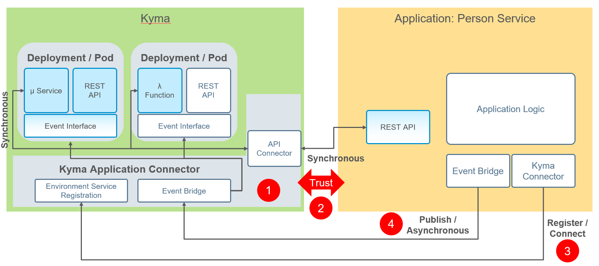

1. Create/Deploy new Application Connector Instance on Kyma &rarr; This is to provide a dedicated Enpoint for the Person Service to connect to Kyma
2. Pair Person Service with Kyma Application Connector &rarr; This is to establish secure connectivity from Person Service to Kyma (even over public networks)
3. Register Person Service Metadata at the Application Connector &rarr; This is to fill the API and Event Catalog on Kyma
4. Fire Events to the Kyma Event Bridge &rarr; This is to execute event driven logic/extensions on Kyma

Steps 3 and 4 are based on deploying additional configuration to the kyma instance.

### Create new Application Connector Instance on Kyma

To connect external systems (called Applications) you need to use the application connector. For information see: https://kyma-project.io/docs/latest/components/application-connector.

To create one, you need to issue the following command:  
`kubectl apply -f app-personservice.yaml`

Shortly after this your new Application will show up in the Kyma Console.

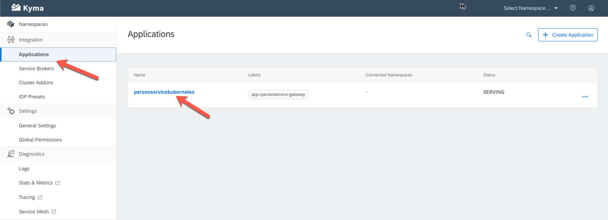

###  Pair Person Service with Kyma Application Connector  
To pair the Person Service with Kyma we will present two approaches.  
In the [automatic flow](#Automatic-Pairing-with-Kyma) you pass the URL generated in Kyma to the Person Service and the certificate requests and actual registration is handled by the service itself. This is the easy way and lets you move on fast. This is the recommended flow. 
The [manual flow](#Manual-Pairing-with-Kyma) gives you full control of the steps and guides you through the requests to generate a certificate and register at Kyma. This includes more work but provides a deeper insight into the mechanics of Application Connectivity.  

First, you need to update the application to enable the Application Connector profile. This will show you the REST endpoints for the automatic and manual flow.

We first create a configmap with the registrationfile that the Person Service posts against Kyma to register its API and events. After that execute the following command:  
`kubectl create configmap registrationfile --from-file=registration/registrationfile.json -n personservice`

To enable the Application Connector endpoints we reconfigure our service. Before deploying please apply the changes highlighted with `#changeme` for [Local Deployment](#deploy-kyma-locally-minikube) or [Cluster Deployment](#deploy-kyma-in-a-cluster):  

* Cluster: `kubectl apply -f mongo-kubernetes-cluster2.yaml -n personservice`
* Minikube: `kubectl apply -f mongo-kubernetes-local2.yaml -n personservice`

Make sure the new pod is created (otherwise delete the old pod, Kubernetes will recreate one). To check whether your changes are active, issue the following command and wait until you again have **exactly** 1 Pod of `personservice-*-*` in status running:  
`kubectl get pods -n personservice -w`

### Option 1: Manual Pairing with Kyma
This sub chapter describes how to manually issue the necessary requests and handle the certificates. This will allow you to fully understand the steps of how applications register to Kyma. At the end of this section we will manually upload the JKS to our "manual" endpoint.

1. Click on `Connect Application` and **open the link in the popup box in another browser tab**.


2. Copy the `csrUrl` address and make sure to save the `infoUrl` somewhere. We will need it for the REST request in the last step.
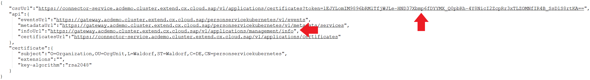

3. Create a Certificate Signing request using OpenSSL (https://www.openssl.org/) a series of commands. Before doing this create a new directory called `security` and then go ahead with OpenSSL in the new dir.
Create Key: 

```
openssl genrsa -out personservicekubernetes.key 2048
openssl req -new -sha256 -out personservicekubernetes.csr -key personservicekubernetes.key -subj "/OU=OrgUnit/O=Organization/L=Waldorf/ST=Waldorf/C=DE/CN=personservicekubernetes"
```

4. Encode the content of `personservicekubernetes.csr` (Base64) and use the REST client of your choice to create the following POST call to the full URL (csrUrl) with the token you copied previously:
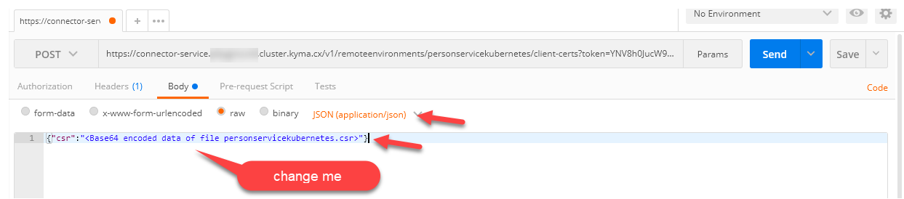
5. After sending you will receive a base 64 encoded signed certificate. Decode the response and save as `personservicekubernetes.crt`. The decoded response will contain separators with `BEGIN CERTIFICATE` and `END CERTIFICATE` respectively.
6. Now you can use OpenSSL and java keytool (part of the jdk) to create a PKCS#12 (P12, also good for browser based testing) file and based on that create a Java Key Store (JKS, for the Person Service) for our service. **Do not change any passwords, except if you really know what you are doing!!!**
   ```
   openssl pkcs12 -export -name personservicekubernetes -in personservicekubernetes.crt -inkey personservicekubernetes.key -out personservicekubernetes.p12 -password pass:kyma-project
   keytool -importkeystore -destkeystore personservicekubernetes.jks -srckeystore personservicekubernetes.p12 -srcstoretype pkcs12 -alias personservicekubernetes  -srcstorepass kyma-project -storepass kyma-project
   ```
7. Now copy the resulting `personservicekubernetes.jks` file to `security` directory.
8. Use the POST `/applicationconnector/registration/manual` endpoint to register the application now. You need to pass the `infoUrl` the password we used for the JKS (`kyma-project`) and the JKS file.


To test your deployed application connector instance you can also import the personservicekubernetes.p12 file into your Browser and call the url depicted as metadataUrl in the initial pairing response JSON.

### Option 2: Automatic Pairing with Kyma
This section describes the "automatic" approach where the application takes care of the requests and certificates. 

1. Click on `Connect Application` and **copy the link in the popup box**.


1. You can use the POST `/applicationconnector/registration/automatic` endpoint of the personservice where you insert the URL created from the Kyma `Connect Application` button into the JSON 

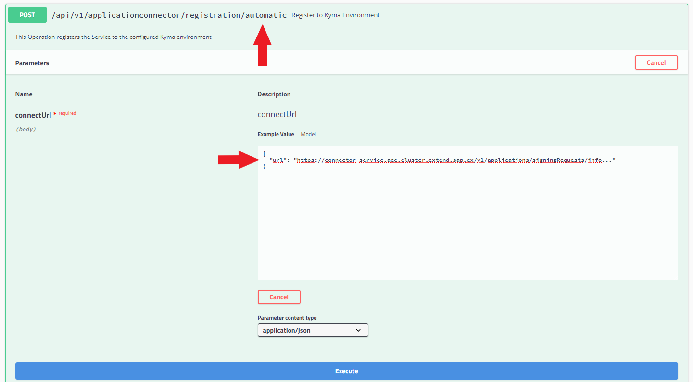

The request should succeed with a status code 200 and an ID in the response body. You can now see the registered Person Service in the Kyma Application.

### Checks

After either the manual or automatic flow you should be able to see the following under Applications:  


This means now you can bind this Application to a Kyma Namespace and process events in Serverless Lambda functions. You can either use the UI or kubectl. In the UI, bind the Application by clicking `Create Binding`. On kubectl issue kubectl apply `kubectl apply -f app-personservice-namespace-map.yaml` to do the same.

Then navigate to the Namespace "personservice" and select the "Catalog" and explore the Service 'Person API' (see screenshot).

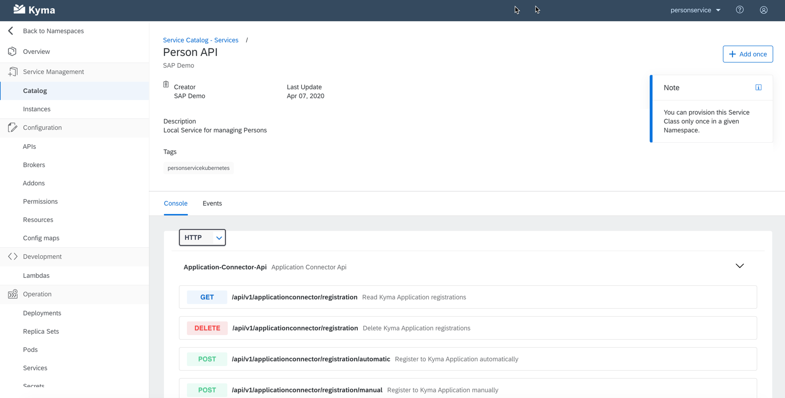

Now you are ready to instantiate the service and bind it to Lambda's and deployments which implement your extension logic.

## Extend your Person Service

### Intro

The preferred way to extend business applications with Kyma is through event driven Lambda (serverless) functions. In the subsequent chapters you will see how to implement such a Lambda function using Node.js and how to bind it to the person maintained Event. 

The function as such is pretty simple. It is triggered when a person was created. Then the logic goes as follows:

1. Call personservice API to retrieve details about the person that what changed (GET /api/v1/person/{id})
2. Call personservice API to retrieve a list of persons with the same values (POST /api/v1/search)
3. Call personservice API to persist a list of IDs on the extension field "duplicatePersons" (PATCH /api/v1/person/{id}) for all identified duplicates

As always this function is not intended for productive use. 

### Create Service Instance

A precondition for this scenario is that all steps mentioned in [Connect your Service to Kyma as Extension Platform](#connect-your-service-to-kyma-as-extension-platform) have been executed properly (manually or automatically).

In your Kyma Namespace `personservice` go to the Catalog and create a new service instance of the Person API:


After that verify your instance by selecting "Instances" in the Service Catalog:

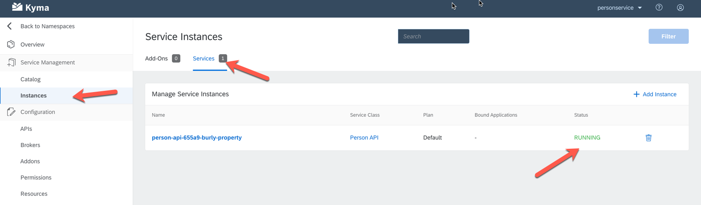


### Develop your Lambda Function

When developing Lambda functions, I like to start locally using the IDE of my choice. Kyma lambda functions are basically "normal" Node.js modules containing the containing the following snippet:

```
module.exports = { 
	main: function (event, context) {
		//code goes here
	} 
}

```

The meaning and contents of the event and context object is described in https://kyma-project.io/docs/latest/components/serverless.  
As soon as a Lambda requires NPM dependencies, it also requires a package.json file (easiest way to create a skeleton is `npm init`). Dependencies are then managed in the dependencies section:

```
{
  "name": "personservicelambda",
  "version": "1.0.0",
  "description": "Demo Lambda for the Person Service",
  "main": "personservice.js",
  "keywords": [
    "kyma"
  ],
  "dependencies": {
    "axios": "^0.18.0",
    "winston": "^3.0.0",
    "express": "^4.16.3",
    "dotenv":"^6.0.0"
  }
}
```

Kyma injects service bindings (including Applications) as Environment Variables. To be able to mimic this behavior locally the package `dotenv` can be used. It basically converts the contents of a `.env` (no file extension, literally ".env") to normal environment variables that can be accessed through `process.env.environment_variable_name` in your code. Sample for that would be (getting the internal URL of the API Connector pointing to the Remote Environment):

```
require('dotenv').config();

console.log(`GATEWAY_URL = ${process.env.GATEWAY_URL}`);
```

To run your Lambda locally you also need a wrapper. The below snippet is actually used to run the code of the sample Lambda:

```
require('dotenv').config();
const personservice = require('./personservicemodule');
var express = require('express');
var app = express();

console.log(`GATEWAY_URL = ${process.env.GATEWAY_URL}`);

app.get("/", async function (req, res) {
    var event = {
        "data": {
            "personid":req.query.personId
        },
        "extensions": {
            "request": req,
            "response":res
        }
    };
    await personservice.main(event,{});
});

app.listen(3000, function () {
    console.log('Example app listening on port 3000!');
  });
```


The code for the sample Lambda function is contained in the "Lambda" folder. in order to run it locally, ensure you have a Node.js (https://nodejs.org/en/download/) environment (Version 8.x+ installed, to check, execute `node --version`). You also need to make a few changes to the ".env" file. Again you need to replace all occurrences of replaceme. "GATEWAY_URL" must have a value pointing to your deployment of personservice (only root, no "/" in the end).
The wrapper starts a local http server on port 3000 that uses the query parameter personId which must be the ID of a person in your mongo db (basically GET /api/v1/person/{PERSON_ID} must return a 200 status code). 

Then install the dependencies: `npm install axios winston dotenv express`
After that you can run your service: `node personservicecaller.js`

Once this is done you can send requests through `http://localhost:3000?personid=<your personid>` and execute the function locally.

This should give you a fair idea of how to develop Lambdas.


### Deploy your Lambda Function

To deploy your Lambda you need to go to your `personservice` Kyma namespace. Click on Lambdas and create a new one. Fill all the fields as shown in the below screenshots and then save:

* Name: mark-duplicate-persons
* Labels: app=mark-duplicate-persons
* Code: [Lambda/personservicemodule.js](Lambda/personservicemodule.js)
* Dependencies: [Lambda/package_lambda.json](Lambda/package_lambda.json)
* Binding: person-api-*-*
* Event Trigger: `person.created`
* Environment Variable: `application_log_level`:  `info`


**Important:** Leave the prefix empty!

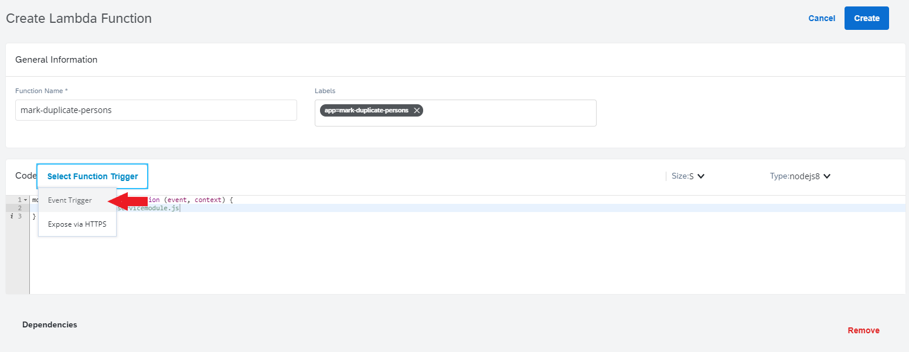

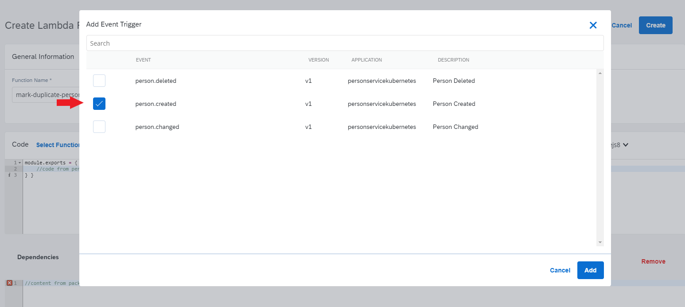


Now the command `kubectl get pods -n personservice -l app=mark-duplicate-persons -w` should return a pod in status running (might take a bit of time though). Now you can issue the following command to inspect the logs:  
`kubectl logs -n personservice -l app=mark-duplicate-persons -c mark-duplicate-persons`  

As nothing is happening, you should only see the periodic health checks:

```
::ffff:127.0.0.1 - - [28/Aug/2018:14:37:48 +0000] "GET /healthz HTTP/1.1" 200 2 "-" "curl/7.38.0"
::ffff:127.0.0.1 - - [28/Aug/2018:14:37:53 +0000] "GET /healthz HTTP/1.1" 200 2 "-" "curl/7.38.0"
::ffff:127.0.0.1 - - [28/Aug/2018:14:37:58 +0000] "GET /healthz HTTP/1.1" 200 2 "-" "curl/7.38.0"
::ffff:127.0.0.1 - - [28/Aug/2018:14:38:03 +0000] "GET /healthz HTTP/1.1" 200 2 "-" "curl/7.38.0"
::ffff:127.0.0.1 - - [28/Aug/2018:14:38:08 +0000] "GET /healthz HTTP/1.1" 200 2 "-" "curl/7.38.0"
::ffff:127.0.0.1 - - [28/Aug/2018:14:38:13 +0000] "GET /healthz HTTP/1.1" 200 2 "-" "curl/7.38.0"
::ffff:127.0.0.1 - - [28/Aug/2018:14:38:18 +0000] "GET /healthz HTTP/1.1" 200 2 "-" "curl/7.38.0"
::ffff:127.0.0.1 - - [28/Aug/2018:14:38:23 +0000] "GET /healthz HTTP/1.1" 200 2 "-" "curl/7.38.0"
```

On the UI, inspecting the logs is a little more comfortable. However this functionality is **not available on minikube**. The below screnshots show where to find them:


The logs are also available in the development screen of lambdas.


### Test your Lambda

Now you can again use the API as depicted in section [Try out on Kyma](#try-out-on-kyma). Here you basically only have to create a new person using the POST /api/v1/person operation (make sure the record is **unique in your Database**. The easiest way to ensure that, is to invoke the DELETE /api/v1/person operation to empty the database). Make sure you get a 201 response code.

The log, inspected by `kubectl logs -n personservice -l app=mark-duplicate-persons -c mark-duplicate-persons`, should contain something similar to:

```
Log level 'info'
{"level":"info","message":"Event received for personid '5b85601a8a50350001a0c160'"}
::ffff:127.0.0.1 - - [28/Aug/2018:14:45:47 +0000] "POST / HTTP/1.1" 200 - "-" "Go-http-client/1.1"
{"level":"info","message":"Number of matching Persons found: 1"}
```

This means the lambda was executed and no duplicates have been found (search returned only one result). Now create a duplicate using the POST /api/v1/person operation. Again make sure you get a 201 response code.

Now the log, inspected by `kubectl logs -n personservice -l app=mark-duplicate-persons -c mark-duplicate-persons`, should contain something similar to:

```
{"level":"info","message":"Event received for personid '5b85601a8a50350001a0c160'"}
::ffff:127.0.0.1 - - [28/Aug/2018:14:49:01 +0000] "POST / HTTP/1.1" 200 - "-" "Go-http-client/1.1"
{"level":"info","message":"Number of matching Persons found: 2"}
{"level":"info","message":"Person 5b8560dd4b2eaa0001897227 successfully updated"}
{"level":"info","message":"Person 5b85601a8a50350001a0c160 successfully updated"}
```

Also invoking GET /api/v1/person/{id} should now show a result with extensionFields/duplicatePersons containing an array of person IDs:

```
{
  "id": "5b8560dd4b2eaa0001897227",
  "firstName": "John",
  "lastName": "Doe",
  "streetAddress": "Nymphenburger Str.",
  "houseNumber": "86",
  "zip": "80636",
  "city": "Muenchen",
  "extensionFields": {
    "duplicatePersons": [
      "5b85601a8a50350001a0c160",
      "5b8560dd4b2eaa0001897227"
    ]
  }
}

```

## Bind your Person Service to a brokered Redis Backing Service 

### Intro

Applications often times require backing services such as databases, caches, message brokers, etc. In a cloud world, these are generally provided and managed by the cloud provider with clear SLAs. These services are generally discovered in a central service catalog. Once a service is deemed relevant it is instantiated (i.e. a Service instance is created, which would map to a e.g. a database instance). This instance is then provided to your application using a binding (i.e. the configuration needed to access the service is injected into the application/container using environment variables). This process nicely decouples application from cloud infrastructure and hence makes it portable accross environments.

In this example we are going to address the issue with frequent callbacks of the lambda to our service. To minimize the load for the (Mongo) database, we are going to introduce caching. For that we are going to enable caching in the Spring Application and hook it up to a Redis cache which is provisioned via the [Helm broker](https://kyma-project.io/docs/components/helm-broker/#overview-overview) (a hidden feature of Kyma making cloud like service brokers also available locally, it basically wraps the same procedure we have used to provision the [Mongo DB](#mongo-db) in a "normal" service broker process). 

### Create Redis Service Instance and Bind it to the Person Service

To populate redis to your Catalog, go to your `personservice` namespace and click on `Add-Ons` -> `Add new configuration`:


Add `https://github.com/kyma-project/addons/releases/download/0.11.0/index-testing.yaml`. 

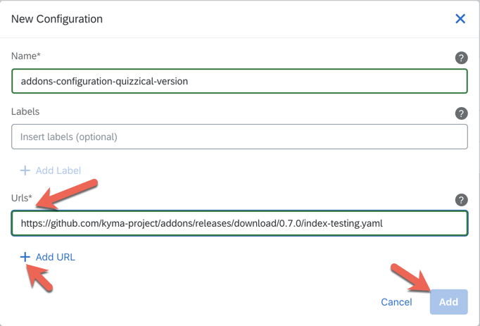

After some time the status will be switched to `Ready` and you can proceed:

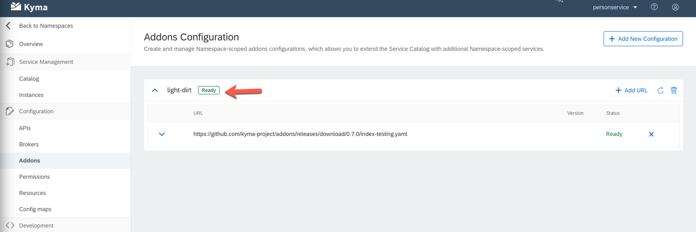

To create a service instance you need to go to the service catalog in your Kyma Namespace ("personservice"). Navigate to Redis:


Add and configure a new instance to your namespace:


After you have created your instance you have to wait for a bit. At first the instance will be in `Provisioning` state.

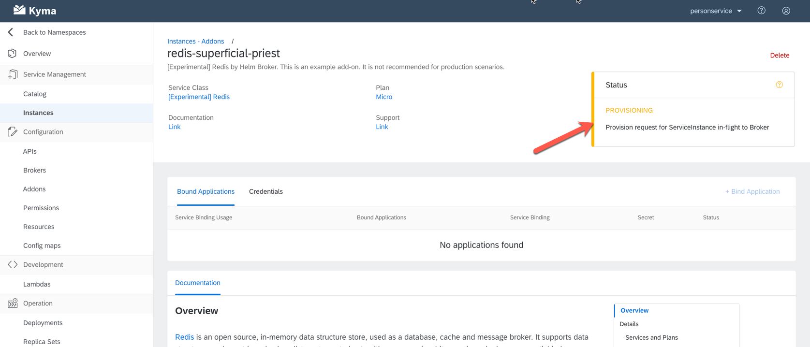

Then it will move to `Running` state.

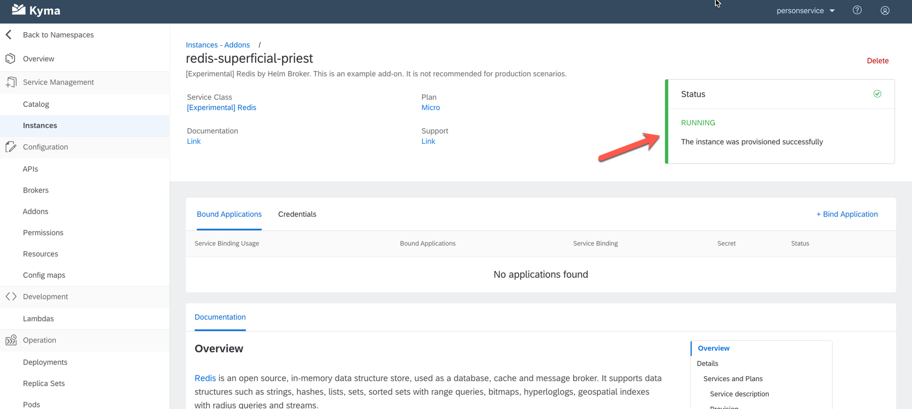

After provisioning the service instance, you can bind itt to the personservice deployment. To do that, you can remain in the instances view (if you haven't clicked anywhere ;-)). If you have, follow the below navigation.

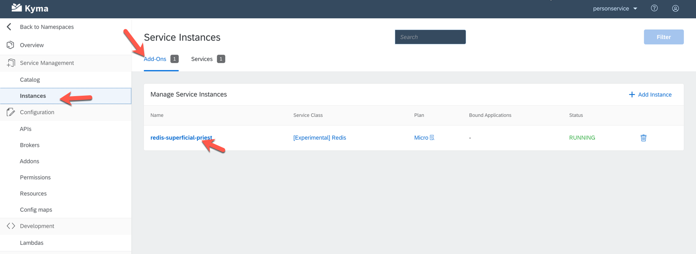

Bind a new application and click through the wizard:


After that, check whether your personservice pods are running: `kubectl get pods -n personservice -l app=personservice -w`

Then invoke the environment api of the person service (this is returning a json representation of all environment variables part of the container):`https://personservice.{cluster}/api/v1/environment` and search for the following variables:

* HOST
* PORT
* REDIS_PASSWORD

If you don't find them, restart your pods and try again: `kubectl delete pods -n personservice -l app=personservice`.

The variables are injected through the Binding (details are available in the documentation).

```
spec:
  containers:
  - envFrom:
    - secretRef:
        name: redis-instance-binding
```

To see the concrete values, go back to your service instance and click on the secret associated to it as shown in the screenshots below:


If you prefer the cli: `kubectl get secret -o yaml <name_of_secret>`. You can find the name of the secret in the "secret" column of your "bound applications". The values are base64 encoded.


### Update Kubernetes Deployment Configuration

In order for the personservice to properly connect to the redis cache, you need to set a couple of environment variables. To do so, `mongo-kubernetes-local3.yaml` or `mongo-kubernetes-cluster3.yaml` have been adapted. However you still need to replace the values depicted with `#changeme` to cater to your environment. Below the changed values to bind to the service:

```
              - name: spring_profiles_active
                value: "ApplicationConnector,Cache"
              - name: logging_level_com_sap_demo_service
                value: "TRACE"
              - name: spring_redis_host
                value: "${HOST}"   
              - name: spring_redis_port
                value: "${PORT}"
              - name: spring_redis_password
                value: "${REDIS_PASSWORD}"
```

To cater for caching the following changes are made to the file:

* `spring_profiles_active`: This is used to activate the PersonServiceCache.java implementation
* `logging_level_com_sap_demo_service`: Activate logging to be able to see cache in trace results
* `spring_redis_host`: This is to provide a reference to the redis host. By putting the value in the proposed format (${HOST}) you are pointing spring to another environment variable which is introduced through the binding.
* `spring_redis_port`: This is to provide a reference to the redis port.
* `spring_redis_password`: This is to provide a reference to the redis password.

To activate the intended changes deploy the file to your environment:

* Local:

`kubectl apply -f mongo-kubernetes-local3.yaml -n personservice`  

* Cluster:

`kubectl apply -f mongo-kubernetes-cluster3.yaml -n personservice`  


### Test the Service

To test this you will have to stream the logs of your personservice. To do this issue the following command:  
`kubectl logs -n personservice $(kubectl get pods -n personservice -l app=personservice -o=jsonpath='{.items[*].metadata.name}')  personservice --follow`.

Alternatively you can go to the UI and display the pod logs there:


Now invoke GET /api/v1/person/{personid}. During the first call you should see something along the lines of the below example. All subsequent calls will not appear as they will be directly fetched from the cache.

**UI (not on minikube)**


**CLI**

```
Entering public com.sap.demo.entity.Person com.sap.demo.service.PersonServiceCache.findPerson(java.lang.String) with Arguments:
class java.lang.String: 5b8560dd4b2eaa0001897227
2018-08-31 11:20:50.577 DEBUG 1 --- [nio-8080-exec-2] com.sap.demo.service.PersonServiceCache  : 2e8ff093-4c1c-9b1b-a274-5e8a63f1cc84: Cache miss for Person ID: 5b8560dd4b2eaa0001897227 
2018-08-31 11:20:50.577 TRACE 1 --- [nio-8080-exec-2] com.sap.demo.service.PersonServiceCache  : 2e8ff093-4c1c-9b1b-a274-5e8a63f1cc84:
Exiting PersonServiceCache.findPerson(..) with result: Person(id=5b8560dd4b2eaa0001897227, firstName=John, lastName=Doe, streetAddress=Nymphenburger Str., houseNumber=86, zip=80636, city=Muenchen, extensionFields={duplicatePersons=[5b85601a8a50350001a0c160, 5b8560dd4b2eaa0001897227]})
```

## Protect the Service

### Intro

Kyma's [API Gateway](https://kyma-project.io/docs/components/api-gateway-v2/) can do much more than just expose services outside of the cluster. Through the contained OAuth2 Server it can also handle authentication and simple authorization tasks. As a developer this lets you focus on the application logic without implementing security concerns inside of your service. To secure our service we need to create an OAuth2 Client and then secure the API endpoint of our Personservice. Lastly we need to update the application connector to also leverage the new OAuth credentials.


### Register an OAuth2 Client

We will register two clients. One will have admin access: `personservice-client-admin`. Another one will only have access to the Person API `personservice-client-api`.

To create them issue the following CLI statements:

```
kubectl apply -n personservice -f oauth2-client-admin.yaml
kubectl apply -n personservice -f oauth2-client-api.yaml
```

This will generate a set of credential. You can now retrieve them via the cli or the UI.

**UI**


**CLI**

```
export API_CLIENT_ID=$(kubectl get secret -n personservice personservice-client-api -o jsonpath='{.data.client_id}' | base64 --decode)
echo "API Client ID: $API_CLIENT_ID"

export API_CLIENT_SECRET=$(kubectl get secret -n personservice personservice-client-api -o jsonpath='{.data.client_secret}' | base64 --decode)
echo "API Client Secret: $API_CLIENT_SECRET"

export ADMIN_CLIENT_ID=$(kubectl get secret -n personservice personservice-client-admin -o jsonpath='{.data.client_id}' | base64 --decode)
echo "API Client ID: $ADMIN_CLIENT_ID"

export ADMIN_CLIENT_SECRET=$(kubectl get secret -n personservice personservice-client-admin -o jsonpath='{.data.client_secret}' | base64 --decode)
echo "API Client Secret: $ADMIN_CLIENT_SECRET"
```

Please take note of them as we will need them later.

### Add Authentication/Authorization to the exposed API

The aim is to achive the following:

1. The Swagger UI Can be accessed without authentication
2. The `admin` scope (conatined in admin client) is required for calls to:
   * /api/v1/applicationconnector
   * /api/v1/environment
3. The `api` scope (conatined in admin & api client) is required for calls to
   * /api/v1/person

To do that the apirule configuration has been changed as follows:

```
apiVersion: gateway.kyma-project.io/v1alpha1
kind: APIRule
metadata:
  name: personservice
spec:
  gateway: kyma-gateway.kyma-system.svc.cluster.local
  rules:

# Requires no Authentication / Authorization
  - accessStrategies:
    - handler: noop
    methods:
    - GET
    path: /swagger-ui.html
  - accessStrategies:
    - handler: noop
    methods:
    - GET
    path: /swagger-resources.*
  - accessStrategies:
    - handler: noop
    methods:
    - GET
    path: /webjars/.*
  - accessStrategies:
    - handler: noop
    methods:
    - GET
    path: /v2/api-docs.*


# Requires admin scope and hence Authentication / Authorization
  - accessStrategies:
    - handler: oauth2_introspection
      config:
        required_scope: ["admin"]
    methods:
    - GET
    - POST
    - PUT
    - PATCH
    - DELETE
    path: /api/v1/environment.*
  - accessStrategies:
    - handler: oauth2_introspection
      config:
        required_scope: ["admin"]
    methods:
    - GET
    - POST
    - PUT
    - PATCH
    - DELETE
    path: /api/v1/applicationconnector.*

# Requires admin scope and hence Authentication / Authorization
  - accessStrategies:
    - handler: oauth2_introspection
      config:
        required_scope: ["api"]
    methods:
    - GET
    - POST
    - PUT
    - PATCH
    - DELETE
    path: /api/v1/person.*
  service:
  #changeme: Replace "{clusterdomain}" with your cluster's domain
    host: personservice.{clusterdomain}
    name: personservice
    port: 8080
```


If you are running on a cluster, adapt `api-security.yaml` to your cluster. You need to replace the `{clusterdomain}` value in the `host` field with your own cluster's domain as always. Again it is flagged with  `#changeme`.

Then you can apply it with the following command: `kubectl apply -f api-security.yaml -n personservice`. 

If you run on minikube you can diirectly apply `kubectl apply -f api-security-local.yaml -n personservice`

Now you can reload the swagger ui (location `https://personservice.{clusterdomain}/swagger-ui.html`). This will load normally. However when you invoke the `/api/v1/person` endpoint you will get an HTTP 401 - Unauthorized response.

```
{
  "error": {
    "code": 401,
    "status": "Unauthorized",
    "request": "54cba7a1-f005-4f8d-bbbf-ea5bdc31dac2",
    "message": "The request could not be authorized"
  }
}
```
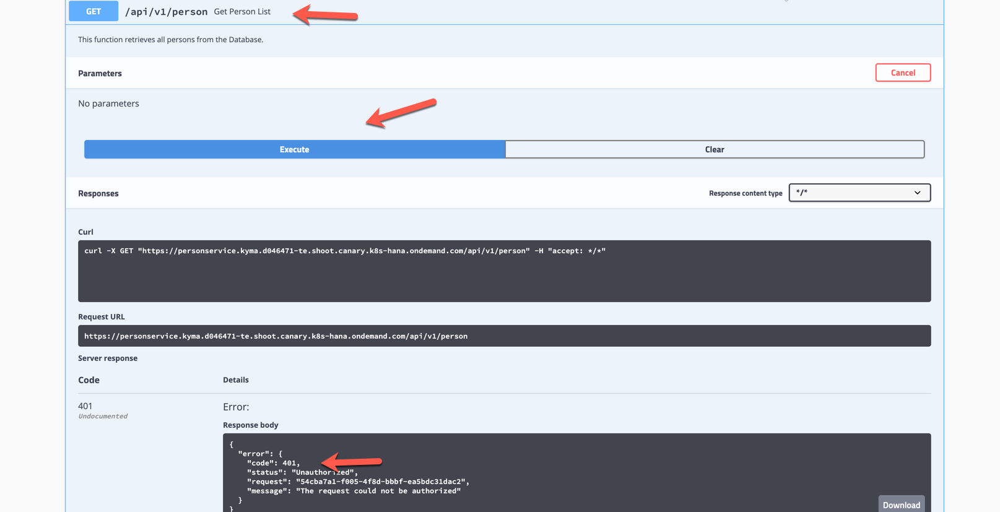.

As the current swagger ui does not allow us to enter authentication data, we need to update the application as well. This is only for demo purposes. A normal application could be used as is.

If you work with your own docker image, you can again replace it in `mongo-kubernetes-cluster4.yaml` or `mongo-kubernetes-local4.yaml`. Otherwise the file is ready to be deployed (remember to address respective `changeme` field before):

* Local: `kubectl apply -n personservice -f mongo-kubernetes-local4.yaml`
* Cluster: `kubectl apply -n personservice -f mongo-kubernetes-cluster4.yaml`


To test working with oauth you need a small command line utility called curl. It will help you to make the [OAuth2 Client Credentials](https://tools.ietf.org/html/rfc6749#section-4.4) calls to acquire the tokens required for making calls to the protected APIs. To use the script you need to provide your cluster domain in an environment variable. For that set: `export CLUSTER_DOMAIN={clusterdomain}` to your cluster's domain.

Now you can retrieve the OAuth2 token that has access to the person api:

```
export API_CLIENT_ID=$(kubectl get secret -n personservice personservice-client-api -o jsonpath='{.data.client_id}' | base64 --decode)
export API_CLIENT_SECRET=$(kubectl get secret -n personservice personservice-client-api -o jsonpath='{.data.client_secret}' | base64 --decode)

curl --location -u $API_CLIENT_ID:$API_CLIENT_SECRET  \
--request POST "https://oauth2.$CLUSTER_DOMAIN/oauth2/token" \
--header 'Content-Type: application/x-www-form-urlencoded' \
--data-urlencode 'grant_type=client_credentials' \
--data-urlencode 'scope=api' | jq -r .access_token
```

Now you can go back to the swagger-ui and try again with the token (API Endpoint /api/v1/person):

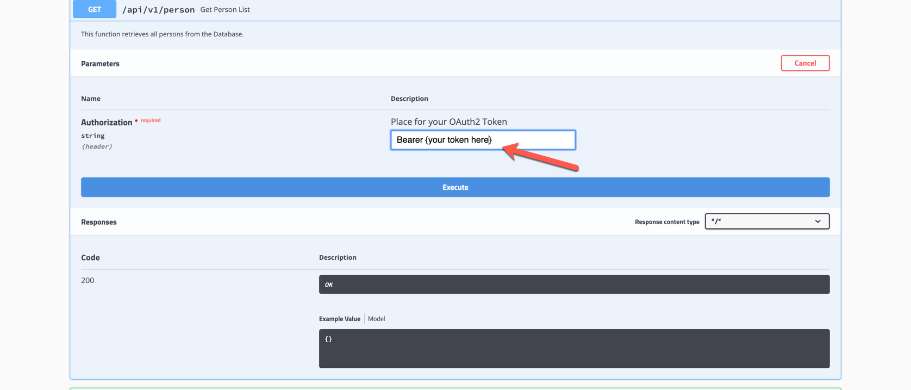.

Now you can use the same token to test an admin API endpoint (/api/v1/applicationconnector or /api/v1/environment). This will fail with an unauthorized error:

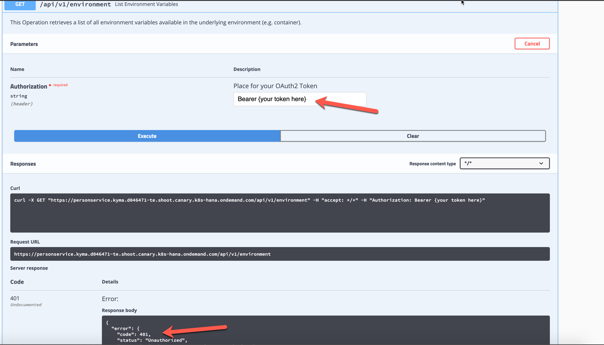.

The below cli statements will help you to get a token that has admin scope. 


```
export ADMIN_CLIENT_ID=$(kubectl get secret -n personservice personservice-client-admin -o jsonpath='{.data.client_id}' | base64 --decode)
export ADMIN_CLIENT_SECRET=$(kubectl get secret -n personservice personservice-client-admin -o jsonpath='{.data.client_secret}' | base64 --decode)

curl --location -u $ADMIN_CLIENT_ID:$ADMIN_CLIENT_SECRET  \
--request POST "https://oauth2.$CLUSTER_DOMAIN/oauth2/token" \
--header 'Content-Type: application/x-www-form-urlencoded' \
--data-urlencode 'grant_type=client_credentials' \
--data-urlencode 'scope=api admin' | jq -r .access_token
```
Now you can use this token to make a successful call to the API (/api/v1/applicationconnector or /api/v1/environment):

.


### Security For Lambdas 

**If you are running this locally you will have issues with failed DNS lookups of the lambda function. There are ways to fix this, but they are not described here (use internal services instead). If you are running on a cluster where APIs have public DNS entries, you can continue.**

When you create a new person, your Lambda will fail. To fix it, we need to adapt the registration file (`/registration/registrationfile.json`). Specifically we need to provide the OAuth2 configuration:

```
"api": {
    "targetUrl": "https://personservice.{clusterdomain}/",
    "spec":{swagger is here, but removed for readability}
    "credentials": {
      "oauth": {
        "url": "https://oauth2.{clusterdomain}/oauth2/token/",
        "clientId": "{API_CLIENT_ID}",
        "clientSecret": "{API_CLIENT_SECRET}"
      }
    },    
}

```

Replace:

* `{clusterdomain}`: the well known value...
* `{API_CLIENT_ID}`: result of `echo $API_CLIENT_ID`
* `{API_CLIENT_SECRET}`: result of `echo $API_CLIENT_SECRET`

Then issue the following commands:

```
kubectl delete configmap -n personservice registrationfile
kubectl create configmap -n personservice registrationfile --from-file=registration/registrationfile.json -n personservice

# Just to ensure your pod has the latest file, would also happen naturally but not in a deterministic timeframe
kubectl delete pod -n personservice -l app=personservice
```

After that issue a POST against `/api/v1/applicationconnector/registration/automatic` with a new "Connect URL". For details refer to [automatic flow](#option-2-automatic-pairing-with-kyma). Remember to use a valid token for that (scope admin is required). It is advisable to acquire a new Token as described before as the old one might be expired. Now your registration should be updated and all lambda calls will acquire a token from the service and supply it for the outbound calls. 


### Test the Service

To test the extension we will now again make a call to create a new person. To do so, issue a POST call to `/api/v1/person`: 

```
{
   "id":"5b8fbe690e66110001f267e2",
   "firstName":"John",
   "lastName":"Doe",
   "streetAddress":"Nymphenburger Str.",
   "houseNumber":"86",
   "zip":"80636",
   "city":"Muenchen",
   "extensionFields":{
      "countryIso2":"DE"
   }
}
```

This should now result in an identified duplicate. For mor comprehensive instructions on testing refer to [Test your Lambda](#test-your-lambda).

***
**Should your Lambda code not work, please have a look at the known issues section with regards to [Application Connector Security](#application-connector-security).**
***

## Operate your Service: Make it Self-Healing

### Intro 
Kubernetes (which Kyma is based on) is built around the assumption that you as a developer declare a target state and kubernetes manages the way to get there. This means that e.g. you specify that your deployment should consist of 2 instances of personservice and kubernetes will ensure that there are always (if resources permit) 2 instances running. Sometimes however we need to get more granular as your service might appear running but is actually hanging and hence damaged, or it is simply to busy to serve traffic. This is where the Self-Healing which we are enabling in this section kicks in.

### Preparation

In order to free-up resources in your cluster, we need to change a couple of things. Basically we need to go back to an older version of our deployment which does not require a redis cache anymore or authentication and authorization. 

If you did follow the steps outlined in [Security For Lambdas](#security-for-lambdas) you need to reverse them. Basically you need to reverse the changes made to the [registration/registrationfile.json](registration/registrationfile.json) by removing the credentials section and replacing the target url:

```

"api": {
    "targetUrl": "http://personservice.personservice.svc.cluster.local",
    "spec":{swagger is here, but removed for readability}
}

```

or you can simply download the old version again.

To bring the chnages back to the cluster, delete the existing configmap and re-create it with changed values:

```
kubectl delete configmap -n personservice registrationfile
kubectl create configmap -n personservice registrationfile --from-file=registration/registrationfile.json -n personservice
```

Now go to your service instances  and unbind your redis service instance from personservice and then delete the service instance. 

To make personservice work again, you also need to roll-back the kubernetes deployment to the state used in [Extend your Person service](#extend-your-person-service). To do that simply issue the following command:

* Cluster: `kubectl apply -f mongo-kubernetes-cluster2.yaml -n personservice`
* Minikube: `kubectl apply -f mongo-kubernetes-local2.yaml -n personservice`


Wait a bit until everything is up and running again (you can watch with `kubectl get pods -n personservice -l app=personservice -w`).

As we have edited the registrationfile, we need to execute automatic pairing again. Follow the steps for [Automatic Pairing with Kyma](#option-2-automatic-pairing-with-kyma) to do that.


After completeing these steps verify that you can create a person using the swagger ui.


### Determining whether your service is alive 

Spring Boot comes with a functionality called actuator. This lets you control and determine the status of the spring application. For the person service we have activated it and exposed it as REST API on port 8081. This nicely separates it from the externally exposed api and keeps it reachable only from within the cluster. The key endpoint for determining service health is the /actuator/health resource. It will return "UP" (HTTP 200) or "DOWN" (HTTP 503). Now we are going to exploit this in kubernetes.

Basically we will make the [Kubelet](https://kubernetes.io/docs/reference/command-line-tools-reference/kubelet/) invoke this actuator periodically and based on the result, 200 or 503, determine whether the service is up or down. If the service is down it should dispose the pod and start a new one to get back to the target state. To do so we need to look the deployment spec (`mongo-kubernetes-cluster5.yaml` or `mongo-kubernetes-local5.yaml`) and find the section for the livenessProbe:

```
        ports:
        - containerPort: 8080
          name: http
        - containerPort: 8081
          name: actuatorhttp
        livenessProbe:
          httpGet:
              path: /actuator/health
              port: 8081
          initialDelaySeconds: 60
          periodSeconds: 60
          failureThreshold: 3  
                    
```

Under ports we have exposed port 8081 with the name actuatorhttp. We have subsequently defined `livenessProbe` which periodically (every 60 seconds) makes a GET request to /actuator/health. If it fails 3 times in a row the container will be disposed and recreated.

### Determining whether your service is ready to serve traffic

Sometimes services are simply just too busy to serve traffic (e.g. when executing batch loads, etc.). This is where kubernetes offers to remove a service from loadbalancing until it reports back. To support this `DemoReadinessIndicator.java` was implemented. It is a custom actuator that reports the readiness status. HTTP 200 means ready and HTTP 503 means not ready.

To periodically invoke this endpoint the following section was added to the deployment manifest (`mongo-kubernetes-cluster5.yaml` or `mongo-kubernetes-local5.yaml`):

```
        readinessProbe:
          httpGet:
              path: /actuator/ready
              port: 8081
          periodSeconds: 30
          initialDelaySeconds: 20
          failureThreshold: 1
          successThreshold: 2  
```

We have defined `readinessProbe` which periodically (every 30 seconds) makes a GET request to /actuator/ready. If it fails 1 time the pod will be excluded from loadbalancing. Only after 2 successful calls it will be again used for loadbalancing.

### Deploying to Kyma

In order for the personservice to be self-healing, `mongo-kubernetes-local5.yaml` or `mongo-kubernetes-cluster5.yaml` have been adapted. However you still need to replace the values depicted with `#changeme` to cater to your environment. 

* Local:

`kubectl apply -f mongo-kubernetes-local5.yaml -n personservice`  


* Cluster:

`kubectl apply -f mongo-kubernetes-cluster5.yaml -n personservice` 

Wait a bit until everything is up and running again (you can watch with `kubectl get pods -n personservice -l app=personservice -w`). 

```
NAME                            READY   STATUS    RESTARTS   AGE
personservice-88d6dc4d6-djc96   2/2     Running   0          84s
personservice-88d6dc4d6-mk4gf   2/2     Running   0          2m46s
```

Take note that both pods star with the same prefix (`personservice-88d6dc4d6-`, which means they are owned by the same deployment). 

### Testing

First of all you should verify that both pods are serving traffic to you. In order to do that, call the `/api/v1/person` endpoint (GET) a couple of times and in the responses check the header `x-serving-host`. It should change frequently and give you back the pod names.

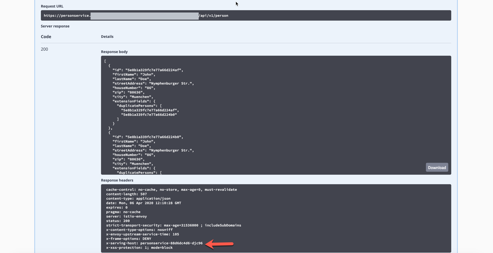.

Now we can start breaking the service. To see the results we first of all issue the following command `kubectl get pods -n personservice -l app=personservice -w`. It will automatically refresh the status of the pods on the commandline.

To make one of the services appear not alive issue a POST Request to `/api/v1/monitoring/health?isUp=false`. This will show the following picture after some time (around 3 minutes):

```
NAME                            READY   STATUS    RESTARTS   AGE
personservice-88d6dc4d6-djc96   2/2     Running   0          8m7s
personservice-88d6dc4d6-mk4gf   2/2     Running   0          9m29s
personservice-88d6dc4d6-djc96   1/2     Running   1          9m7s

```

Now you can in a separate terminal window execute the command `kubectl describe pod -n personservice <podname>` for the pod that was failing. In the event log you will see the following picture:

```
Events:
  Type     Reason     Age               From                           Message
  ----     ------     ----              ----                           -------
  Warning  Unhealthy  26s (x6 over 1h)  kubelet, k8s-agent-27799012-2  Liveness probe failed: HTTP probe failed with statuscode: 503
  Normal   Pulling    22s (x3 over 1h)  kubelet, k8s-agent-27799012-2  pulling image "personservice/mongokubernetes:1.0.0"
  Normal   Killing    22s (x2 over 1h)  kubelet, k8s-agent-27799012-2  Killing container with id docker://personservice:Container failed liveness probe.. Container will be killed and recreated.
  Normal   Pulled     21s (x3 over 1h)  kubelet, k8s-agent-27799012-2  Successfully pulled image "personservice/mongokubernetes:1.0.0"
  Normal   Created    21s (x3 over 1h)  kubelet, k8s-agent-27799012-2  Created container
  Normal   Started    21s (x3 over 1h)  kubelet, k8s-agent-27799012-2  Started container
```

It basically shows that kubernetes is recreating the failing container. After that the container is back alive.

Once everything is back to normal and `kubectl get pods -n personservice -l app=personservice -w` looks like:


```
NAME                            READY   STATUS    RESTARTS   AGE
personservice-88d6dc4d6-djc96   2/2     Running   1          14m
personservice-88d6dc4d6-mk4gf   2/2     Running   0          15
```


Now you can issue a POST request to /api/v1/monitoring/readiness?isReady=60. This will make the readinessProbe fail for 60 seconds. You will again see this in your pod monitor. 

```
NAME                            READY   STATUS    RESTARTS   AGE
personservice-88d6dc4d6-djc96   2/2     Running   1          14m
personservice-88d6dc4d6-mk4gf   2/2     Running   0          15m
	personservice-88d6dc4d6-mk4gf   1/2     Running   0          16m
```

Now you can in a separate terminal window execute the command `kubectl describe pod -n personservice <podname>` for the pod that was failing. In the event log you will see the following picture:

```
  Type     Reason     Age               From                           Message
  ----     ------     ----              ----                           -------
  Normal   Created    4m (x3 over 1h)   kubelet, k8s-agent-27799012-2  Created container
  Normal   Started    4m (x3 over 1h)   kubelet, k8s-agent-27799012-2  Started container
  Warning  Unhealthy  12s (x4 over 4m)  kubelet, k8s-agent-27799012-2  Readiness probe failed: HTTP probe failed with statuscode: 503
```

Also all API calls to `/api/v1/person` endpoint (GET) will have the same value for `x-serving-host`. Hence the other pod was sucessfully excluded from loadbalancing. 

## Operate your Service: Traces and Logs

**This will not work on minikube**

### Intro
Kyma comes with tracing and logging support through Kubernetes, Istio and Jaeger. Tracing is mainly influenced by Istio (https://istio.io/docs/tasks/telemetry/distributed-tracing/) and Jaeger (https://www.jaegertracing.io/). Tracing enables you to corelate requests as they travel from service to service. All you need to do is propagate a set of tracing headers. The rest is taken care of by Istio and Jaeger.

```
   Client Span                                                Server Span
┌──────────────────┐                                       ┌──────────────────┐
│                  │                                       │                  │
│   TraceContext   │           Http Request Headers        │   TraceContext   │
│ ┌──────────────┐ │          ┌───────────────────┐        │ ┌──────────────┐ │
│ │ TraceId      │ │          │ X─B3─TraceId      │        │ │ TraceId      │ │
│ │              │ │          │                   │        │ │              │ │
│ │ ParentSpanId │ │ Extract  │ X─B3─ParentSpanId │ Inject │ │ ParentSpanId │ │
│ │              ├─┼─────────>│                   ├────────┼>│              │ │
│ │ SpanId       │ │          │ X─B3─SpanId       │        │ │ SpanId       │ │
│ │              │ │          │                   │        │ │              │ │
│ │ Sampled      │ │          │ X─B3─Sampled      │        │ │ Sampled      │ │
│ └──────────────┘ │          └───────────────────┘        │ └──────────────┘ │
│                  │                                       │                  │
└──────────────────┘                                       └──────────────────┘
```

Logs are just written to stdout so that they are accessible through `kubectl logs` and log aggregation solutions such as fluentd (not included in kyma).

To embed all of this into our Spring Boot Application, no coding is necessary. All we need to do is embed Spring Cloud Sleuth (https://cloud.spring.io/spring-cloud-sleuth/):

```
<dependency> 
  <groupId>org.springframework.cloud</groupId>
  <artifactId>spring-cloud-starter-zipkin</artifactId>
</dependency>
```

This will ensure our App:

* Extracts and propagates Headers
* Decorates logs with TraceId, ParentSpanId and SpanId

In our Spring app logging uses SLF4J and is mainly based on the `LoggingAspect.java` which uses Aspect Oriented Programming to proxy and log every call to a class within the package hierarchy.

### Testing Tracing

To test the tracing you need to launch the Jaeger UI. Details can be found under https://kyma-project.io/docs/latest/components/tracing. You can access the Jaeger UI either locally at `https://jaeger.kyma.local` or on a cluster at `https://jaeger.{domain-of-kyma-cluster}`.


.

In Kyma tracing is driven out of the Istio Service Mesh. By default only a small percentage of the requests are traced / sampled. This is to reduce the performance impact of observability on the overall application. In the following exercise this is not helpful. Hence we will change the sampling rate to 100%. To do so issue `kubectl -n istio-system edit deploy istio-pilot` and adapt the `PILOT_TRACE_SAMPLING` environment varibale as shown below:

```
        - name: PILOT_TRACE_SAMPLING
          value: "100"
```

Now we send a simple GET to /api/v1/person. In Jaeger we will make the following selections:

* Service: personservice
* Limit Results: 20


Selecting the relevant record we will see the following picture (highlighting the Span created by our Spring Boot Application with application level data):


This shows a simple request which is answered by the Personservice directly without propagation. It enters through Istio. Mixer ensures that all rules are followed, then [Ory Oathkeeper](https://kyma-project.io/docs/components/api-gateway-v2/) enforces proper Authentication and Authorization and then the person service answers the request. The Application adds further tags to it, to make tracing more verbose:

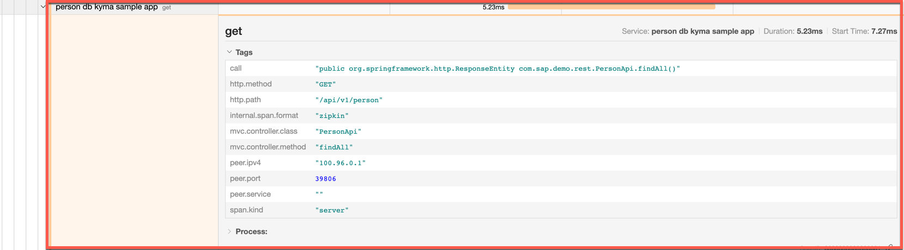

Now we want to get more advanced and change a person which triggers a request to the events endpoint described in [Connect your Service to Kyma as Extension Platform](#connect-your-service-to-kyma-as-extension-platform). It will now also show up in the trace, but be more complex, as there is now also an outbound call to the events API (PATCH /api/v1/person/{id}).


Trace shows the following:

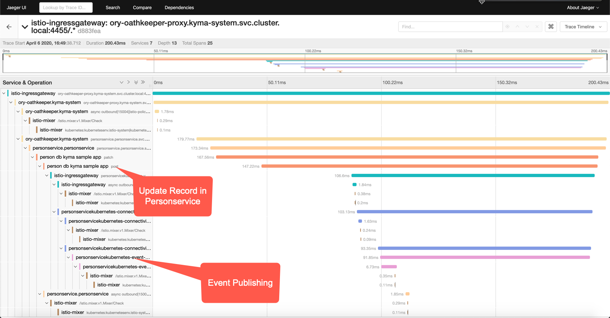


### Testing Logging

Now since we know how the request is going through the Service Mesh, we also want to inspect what was happening within the App. Therefore we need to look into the logs. Fortunately Spring Cloud Sleuth has decorated them for us.

To get there we open one of the traces again and extract the trace id and the pod it was executed on (Example is based on GET /api/v1/person).

)

Under View Options we select Trace JSON. This will provide access to the trace ID:

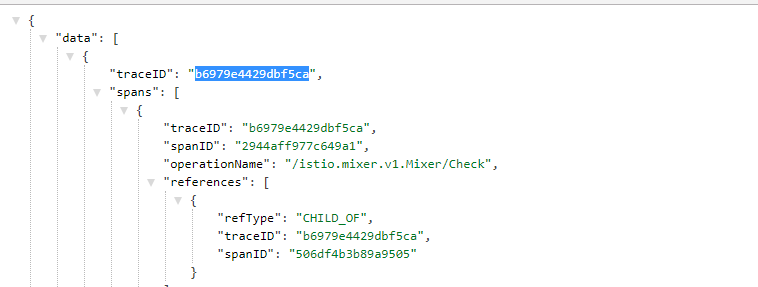

For the pod we found we will issue the following kubectl command to print the logs into a text file:  
`kubectl logs -n personservice -l app=personservice -c personservice | grep {your trace id}`

Based on the trace ID we can now search the logfile and see what happened inside the pod:

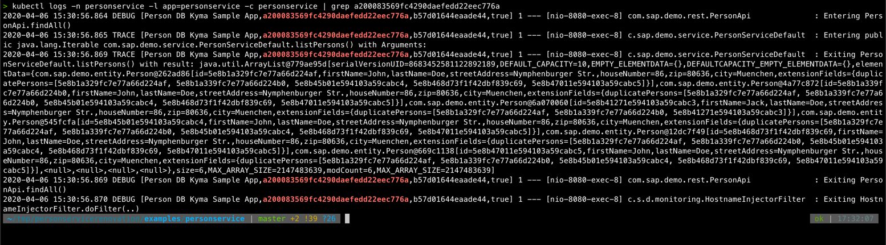 

To make this more simple, Kyma comes with Loki and Promtail (https://kyma-project.io/docs/latest/components/logging). These tools help to aggregate logs within the cluster.

**Be careful, log collection runs asynchronously and hence there might be a small delay.**

Kyma provides an UI to query the Loki service in an easier way. Go to the Kyma home page and select "Logs" on the sidebar. Here you can filter relevant labels (app="personservice", container="personservice"). In the search field, you can then search for your respective trace.

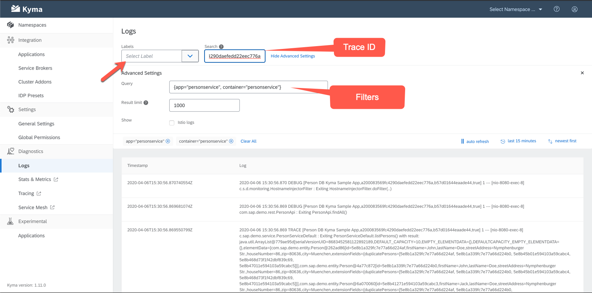

If you know the exact pod reference you can also display logs in the context of the pod as shown below.

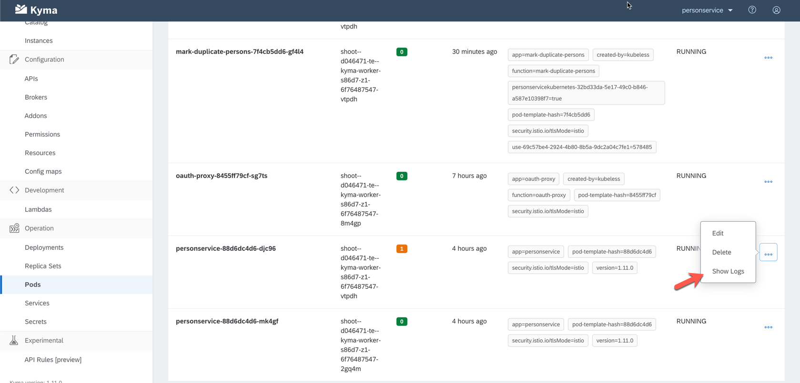
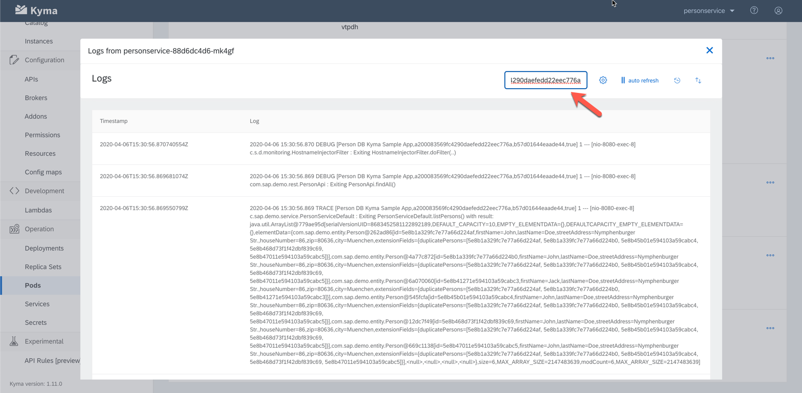

After finishing you can revert trace sampling back to the previous value as shown in the tracing section.

## Operate your Service: Metrics

**This will not work on minikube**

### Intro

Kyma comes with a Prometheus Operator included. This means you can instrument your Services and scrape metrics as described in the [Monitoring Docs](https://kyma-project.io/docs/latest/components/monitoring). In order to instrument Person Service and get application level metrics I have added the following dependency to the Maven POM file:

```
<dependency>
  <groupId>io.micrometer</groupId>
  <artifactId>micrometer-registry-prometheus</artifactId>
</dependency>
```

Furthermore I have added the following lines of code to the `PersonServiceDefault` class:

```
@Autowired
public PersonServiceDefault(MeterRegistry registry, PersonRepository repository) {
  this.repository = repository;
  Gauge.builder("personservice.persistency.repository.size", repository, PersonRepository::count)
      .tag("Repository", "Persons").register(registry);
  
}
```

These add a metric called `personservice_persistency_repository_size` to the `/actuator/prometheus` endpoint so that we can plot them in a chart using Grafana.

### Collecting Metrics in Prometheus

In oder to be able to collect the metrics from Prometheus the following Service needs to be added to the cluster `personservice-actuator-service.yaml`:

```
apiVersion: v1
kind: Service
metadata:
  labels:    
     app: personservice
     version: "1.0.0"
  annotations:
     auth.istio.io/80: NONE
  name: personservice-actuator
spec:
  ports:
  - name: actuatorhttp
    port: 8081
  selector:
    app: personservice
    version: "1.0.0"
  type: ClusterIP
```
Deploy it using   
`kubectl apply -n personservice -f personservice-actuator-service.yaml`.

Now you can configure Prometheus to scrape the metrics. To do so you need to create a resource of type ServiceMonitor. This needs to be part of the `kyma-system` namespace:

```
apiVersion: monitoring.coreos.com/v1
kind: ServiceMonitor
metadata:
  name: personservicekubernetes
  labels:
    app: personservice
    prometheus: monitoring #links to kyma prometheus instance
spec:
  jobLabel: "Personservice"
  selector:
    matchLabels:
      app: personservice # label selector for service
  namespaceSelector:
    matchNames:
    - personservice # links to person service namespace for metric collection
  endpoints:
  - port: actuatorhttp # port name in service
    path: "/actuator/prometheus" # enpoint of spring metrics actuator
```


To create the ServiceMonitor issue: `kubectl apply -f service-monitor.yaml -n kyma-system`. Note that this requires tpermissions in the kyma-system namespace.

Now you can check whether it is working in Prometheus. To do so you need to expose prometheus on your localhost using `kubectl port-forward -n kyma-system svc/prometheus-operated 9090:9090`. Now you can open http://localhost:9090/targets in a browser. You should find a target like in the screenshot below:

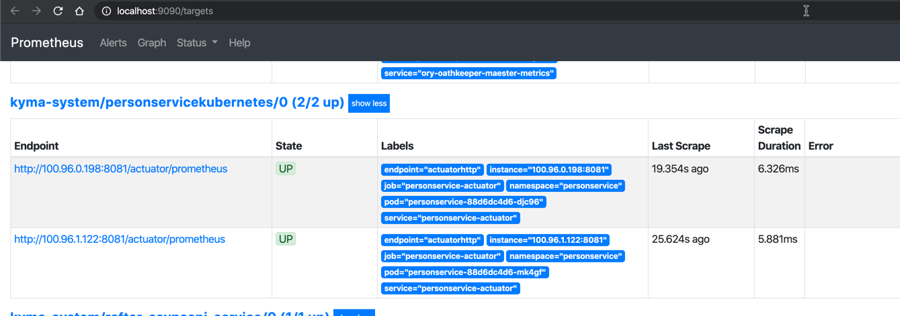

Furthermore you can go to `http://localhost:9090/graph` and issue the following PromQl statement as a verification  `up{job="personservice-actuator"}`. This will should yield something along these lines:

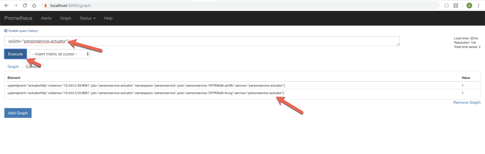

Besides creating dashboards, you can also use the collected metrics for alerting. This will not be depicted here but is rather straight forward.

### Creating a Dashboard

For Dashboarding we can use Grafana. Grafana will visualize the following [PromQL](https://prometheus.io/docs/prometheus/latest/querying/basics/) queries:

* container_memory_usage_bytes{namespace="personservice", container="personservice"}/1000000 ==> Memory usage of the Person Service Pods in Megabytes
* sum(up{job="personservice-actuator"}) ==> Number of instances of the person service
* max(personservice_persistency_repository_size{Repository="Persons"}) ==> Our custom metric for providing the number of Person records in the Mongo DB
* sum by (job,method) (rate(http_server_requests_seconds_count{job="personservice-actuator"}[1m])*60) ==> request rate per Minute and HTTP method

Grafana is accessed from the main menu:


 After Login you will see the below picture and go to "Import":


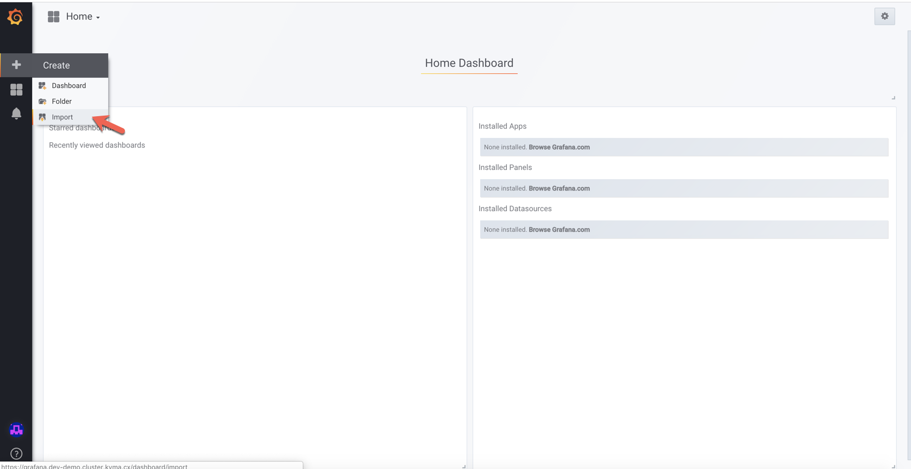

Now upload `Person_Service_Dashboard.json`. 


This will require to wire the dashboard to a datasource called `Prometheus`:


After doing so your dashboard will look as follows:

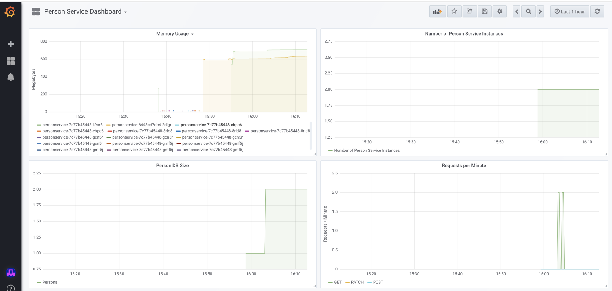

## Known Issues

### Application Connector Security

With Kyma 1.11.0 there is an incompatibility between the Application Gateway component and the API Gateway. This is tracked in Issue [7901](https://github.com/kyma-project/kyma/issues/7901).

To verify whether this issue is related, inspect the logs with `kubectl logs -n kyma-integration -c personservicekubernetes-application-gateway -l app=personservicekubernetes-application-gateway` and watch out for errors like:

```
time="2020-04-06T07:38:27Z" level=error msg="failed to get token : 'incorrect response code '401' while getting token from https://oauth2.{clusterdomain}/oauth2/token/'"
```

To work around that, you need to deploy a proxy that addresses the incompatibilities. Going forward we are going to use a Lambda function for that. How you deploy a lambda is described in much greater detail in section [Extend Your Person Service](#extend-your-person-service).

These are the parameters for the lambda.

* Name: oauth-proxy
* Labels: app=oauth-proxy
* Code: [workarounds/oauth/lambda.js](workarounds/oauth/lambda.js)
* Dependencies: [workarounds/oauth/package.json](workarounds/oauth/package.json)
* Binding: N/A

Below are screenshots illustrating the neccesarry steps:


As you can see this time the lambda is exposed without authentication via https. Now you need to retrieve the https endpoint for testing as well as to update your API registration.


This url is then put as oauth url into the registration file mentioned in [Security For Lambdas](#security-for-lambdas) and essentially the procedure is executed again.

```
"api": {
    "targetUrl": "{same}",
    "spec":{swagger is here, but removed for readability}
    "credentials": {
      "oauth": {
        "url": "{lambda url}",
        "clientId": "{same}",
        "clientSecret": "{same}"
      }
    },    
}
```
