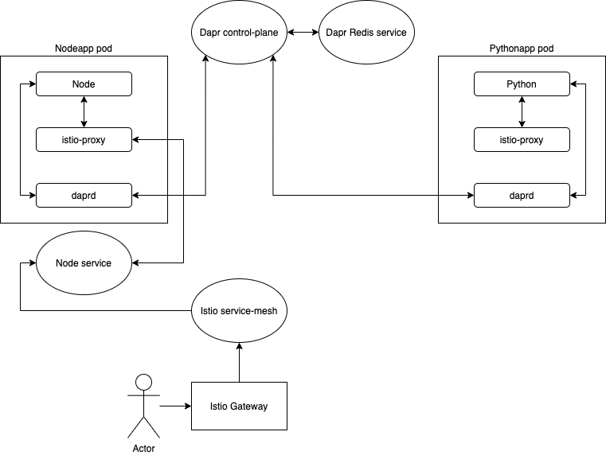

# Dapr & Istio - port capturing
This setup focuses on having Dapr and Istio side-by-side without resigning from the mTLS capacity of both services. This is achieved by manipulating the port capturing functionality.

## Application setup



This diagram illustrates the connections between user applications (`Node` and `Python`) and both sidecars deployed within Pods:
- All communication between both applications is done using the `daprd` proxy, which uses the Dapr Control Plane for service discovery and routing.
- External communication (client to application) is done by the Istio Service Mesh and the `istio-proxy` sidecar.

## Deploy application
The manifests contain the following elements:
- `Namespace`, without the `istio-injection: disabled` label. The workload in this Namespace should contain both Dapr and Istio sidecars
- nodeapp `Deployment` and `Service`
- pythonapp `Deployment`
- `APIRule` for nodeapp which exposes the service using the [Kyma API Gateway](https://github.com/kyma-incubator/api-gateway)

In the deployment you can modify the sidecar-injection context using the following Dapr and Istio labels:

| Label | Explanation |
| :--- | :--- | 
| `dapr.io/enabled: "true"` | Enables application in Dapr and injects the sidecar. |
| `dapr.io/id: "nodeapp"` | Unique ID of the app inside the Dapr internal space. |
| `dapr.io/port: "3000"` | Application port exposed by the app. |
| `traffic.sidecar.istio.io/excludeOutboundPorts: "80,3500,50001,50002,6379"` | Set of ports that should be excluded from Istio outbound traffic capture. Those ports are used by Dapr for internal communication.
| `traffic.sidecar.istio.io/excludeInboundPorts: "80,3500,50001,50002,6379"` | Set of ports that should be excluded from Istio inbound traffic capture. Those ports are used by Dapr for internal communication.

```bash
kubectl apply -f ./manifests/test-app.yaml

# Get the generated Redis password, and inject into the state components
REDIT_PASS=$(kubectl get secret --namespace dapr-redis redis -o jsonpath="{.data.redis-password}" | base64 --decode)

cat <<EOF | kubectl apply -f -
---
apiVersion: dapr.io/v1alpha1
kind: Component
metadata:
  name: statestore
  namespace: dapr-demo
spec:
  type: state.redis
  metadata:
  - name: redisHost
    value: redis-master.dapr-redis:6379
  - name: redisPassword
    value: $(echo ${REDIT_PASS})
---
apiVersion: dapr.io/v1alpha1
kind: Component
metadata:
  name: messagebus
  namespace: dapr-demo
spec:
  type: pubsub.redis
  metadata:
  - name: redisHost
    value: redis-master.dapr-redis:6379
  - name: redisPassword
    value: $(echo ${REDIT_PASS})
EOF

# Wait till the applications deploy 
kubectl get pods -n dapr-demo
```

>**NOTE:** In case of failing containers, please verify if the sidecar injector image has been updated (failing readiness probes in istio-proxy sidecar), and the deployment has all required annotations (connection refused in dapr sidecar)

## Access the app
```bash
KYMA_DOMAIN=$(kubectl get cm -n kyma-installer net-global-overrides -o jsonpath='{.data.global\.ingress\.domainName}')
curl -ik https://nodeapp.${KYMA_DOMAIN}/order
# HTTP/2 200
# x-powered-by: Express
# content-type: text/html; charset=utf-8
# content-length: 14
# etag: W/"e-/KEnkm7h2xoIXDg1R7eGrD7r3Ig"
# date: Fri, 26 Jun 2020 11:33:12 GMT
# x-envoy-upstream-service-time: 4
# server: istio-envoy

# {"orderId":33}
```

## Result analysis
It is possible to have Istio and Dapr working together, both providing their respective services. However, since both applications provide an internal mTLS which is not known to each other, you must define what communication should be protected by which certificate. This can be done by stating the ports that Istio and Dapr should capture respectively.
This solution is very fine-grained and provides a "best of two worlds" approach. However, it requires an extra step when defining application manifests, namely, for each application, you need to add Istio annotations denoting excluded ports.

### Dapr related ports
List of ports used by Dapr, that need to be excluded from Istio:

| Port | Used by | Explanation | 
| :---: | :---: | :--- | 
| `80` | `dapr` | The `dapr-api` service is exposed on port `80`. The `dapr` sidecar communicates with the API using this port. As this is a very commonly used port, this may cause conflicts in some cases. |
| `3500` | `dapr` | The `dapr` sidecar uses this port for mutual application - sidecar communication.|
| `50001` | `dapr` | API gRPC server port. |
| `50002` | `dapr` | Internal gRPC server. |
| `6379` | `redis` | Port exposed by Redis statestore. Required if applications uses the statestore, may vary depending on statestore used. |
